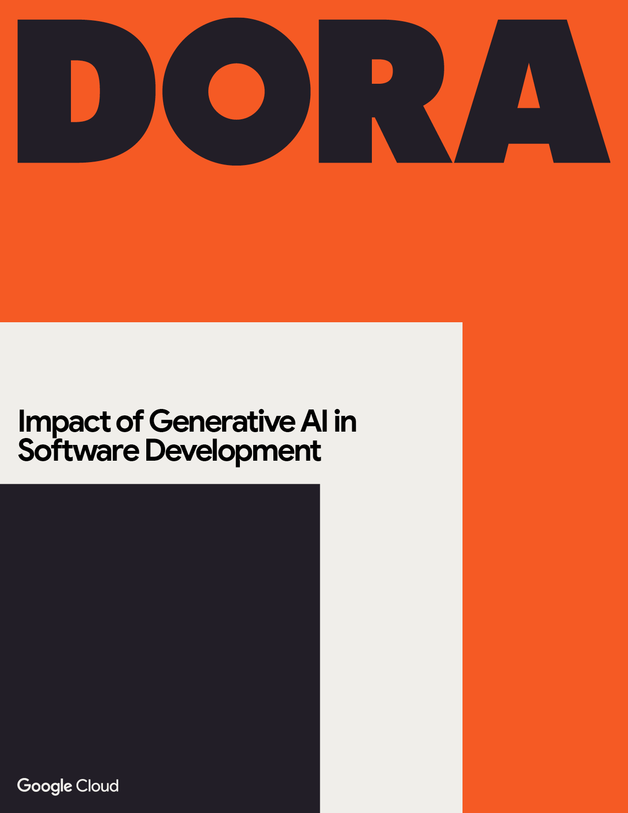

## Impact of Generative AI in Software Development

<grid class="border_none" style="margin-top:1rem;">
<item>

</item>

<item>

Generative AI is rapidly reshaping the software development landscape, presenting both exciting opportunities and complex challenges.

This report offers research-backed guidance for leaders and practitioners to effectively navigate this transformation, providing actionable insights to maximize AI's benefits while mitigating potential risks.

Based on extensive data and developer interviews, the report moves beyond the hype to offer a nuanced perspective on AI's impact on individuals, teams, and organizations.

<a href="dora-impact-of-generative-ai-in-software-development.pdf" target="_blank"><button class="secondary">Download the report</button></a>

</grid>
