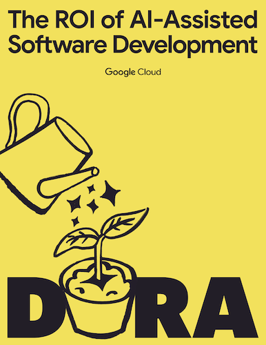

<grid class="border_none mt-1">
<item>

</item>
<item>
    

        DORA's ROI of AI-assisted Software Development report provides a practical framework to help you navigate the complexities of AI adoption. Whether you are managing the initial "productivity dip" of a new rollout or looking to defend your budget for the next fiscal year, this guide provides the calculations and conversation starters you need.
    

    

        <a href="https://cloud.google.com/resources/content/dora-roi-of-ai-assisted-software-development" target="_blank" class="button secondary">Get the report</a>
    

</item>
</grid>
