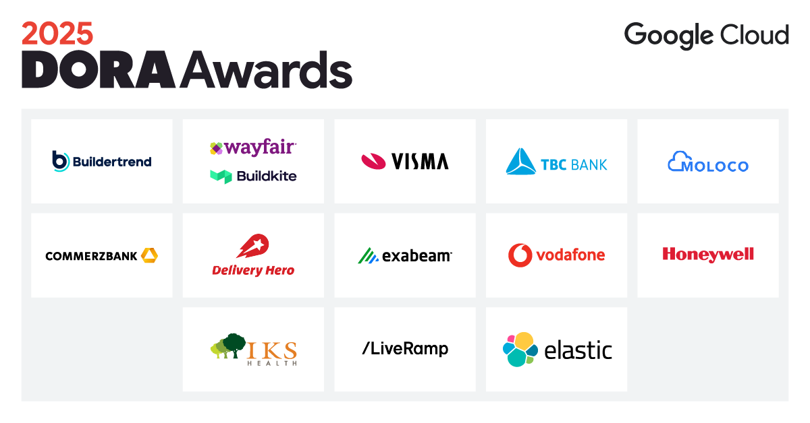

At Google Cloud, we are passionate about helping organizations around the world improve their software delivery and organizational performance. Through the DORA program, we provide research-backed guidance to help teams excel. This year, we've seen tremendous emphasis on the power of AI to augment human expertise and drive innovation.

We are thrilled to celebrate the success of our customers who are at the forefront of this transformation. The annual Google Cloud DORA Awards recognize customers who have demonstrated excellence in implementing DORA principles and capabilities with Google Cloud to achieve outstanding business results.

> "Wayfair learned that the biggest gains came not just from detecting failures faster, but from reducing the effort required to fix them. Embedding AI into the CI/CD loop showed that developers respond best to targeted, explainable suggestions delivered directly in the tools they already use." - **Wayfair**

This year's 13 winners have showcased achievements in leveraging technology to innovate, scale, and lead in the respective industries.

* Architecting for the Future with AI: ElasticSearch
* Augmenting Human Expertise with AI: IKS Health
* Developer Productivity and Velocity: Exabeam
* Embracing Artificial Intelligence: Wayfair and Buildkite
* Enterprise-Scale Transformation: Honeywell
* Going Beyond the Four Keys: Moloco
* Improving Developer Experience: Delivery Hero
* Leveraging Loosely Coupled Teams: TBC Bank
* Nurturing Team Culture: Commerzbank AG
* Operational Excellence and Automation: LiveRamp
* Scaling AI Transformation: Vodafone
* Scaling Improvement Throughout Your Organization: Visma
* Unleashing the Full Power of the Cloud: Buildertrend

> "**Cultural transformation** is just as critical as tooling. Success required not only introducing automation and metrics but also aligning teams around shared goals and ownership.” - **TBC Bank**

## A look ahead: The 2025 DORA Report

The annual DORA Report draws upon the insights and achievements of our award winners and thousands of other organizations. This year's report will once again provide a comprehensive exploration of AI, including capabilities such as AI fluency, AI policy and governance, and its impact on team performance. Get a [sneak peek into this year's report](/research/2025/) and [subscribe to the DORA Community](https://dora.community/) to receive the 2025 DORA Report delivered directly to your inbox the moment it's released.