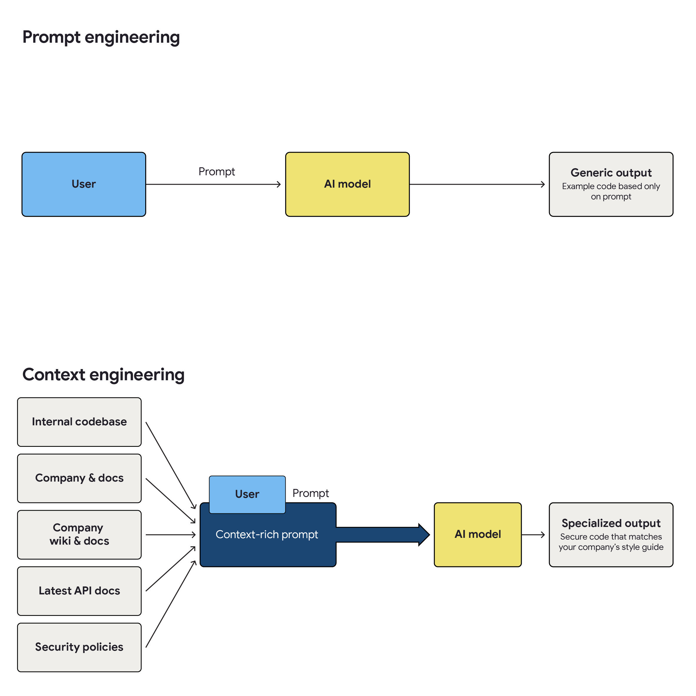

AI-accessible internal data is the capability of securely connecting AI systems to an organization’s proprietary information—such as codebases, documentation, and operational metrics—to provide context-aware responses. This connection, often implemented through a discipline known as context engineering, transforms generic AI models into specialized experts that understand your specific architecture, standards, and business logic.

Think of it as providing the complete “briefing packet” a developer needs to achieve an objective, rather than just a single command. This includes proprietary company data, such as:

*   Internal codebases and architectural diagrams.
*   Wikis, documentation, and style guides.
*   Operational metrics and logs.

> DORA research confirms that giving teams AI tools that can access internal data directly **amplifies the positive impact** of AI adoption, serving as a statistically significant multiplier for **individual effectiveness** and **code quality**.

### Defining the new discipline: A system, not a string

Many teams are familiar with *prompt engineering* (writing a specific command). To unlock real value, organizations must start iterating to context engineering.

A simple prompt is like giving an assistant a single order. Context engineering is the system that automatically gathers relevant information—such as the latest API docs, company policies, and compliant code snippets—and uses it to manage an intelligent workflow. This enables the AI to critique its own work against your standards and improve its output.

<figcaption>Prompt engineering vs context engineering</figcaption>

## The AI angle

This capability is the bridge between “using AI” and “getting value from AI.”

* **Accelerates**
  * **Developer velocity:** converting “tribal knowledge” into instant answers for onboarding and debugging
  * **Pattern enforcement:** automatically validating code against internal standards
* **Risks**
  * **Delivery instability:** Rapid code generation can harm stability if [small batch sizes](/capabilities/working-in-small-batches) are ignored.
  * **Technical debt:** replicating deprecated patterns amplifies debt.
  * **Data exposure:** surfacing sensitive information or secrets if access controls are not enforced.

## How to implement AI-accessible internal data

Improving accessibility to internal data involves a phased approach, starting with manual techniques and progressing toward a more systematic, automated solution.

### Phase 1: Foundational and manual

Start by evolving your prompt engineering skills into manual context engineering. Teams should be empowered to move beyond just writing a query and toward assembling the context the AI needs to answer it.

Provide space for teams to learn how to manually find and attach the most relevant information (like specific API docs, style guides, and code snippets) to their requests. Create a shared, version-controlled library of these reusable context templates or briefing packets for common tasks.

Most importantly, reliable context depends entirely on accessible and accurate internal data. You can’t connect an AI to information that doesn’t exist, and you shouldn’t connect it to information that is wrong. High-quality documentation is a primary driver of AI adoption. Work with teams to identify and improve the most critical internal documentation first.

### Phase 2: Automated Pilot

Determine whether to build a custom solution (for example, using open-source retrieval-augmented generation libraries) or procure a commercial tool that can be securely integrated. Once a tool is selected, implement an automated retrieval solution for a single, high-impact use case.

This step highlights the importance of context engineering. While feeding large, raw documents into an AI’s context window is tempting, it is often counterproductive. This approach frequently results in hallucinations: outputs that sound confident but are factually false.

Instead, effective solutions focus on providing only the most specific context for the current request. Two primary patterns are emerging for this:

*   [**Retrieval-augmented generation (RAG):**](https://cloud.google.com/use-cases/retrieval-augmented-generation) A more complex but precise method for finding and providing only the most relevant, up-to-date information, which can be centralized.

*   **[Model context protocol (MCP)](https://cloud.google.com/discover/what-is-model-context-protocol) server:** An approach that intelligently selects, structures, and feeds only the most relevant context to the AI, rather than entire raw documents.

This phase moves the needle from manual input to automated retrieval, which is a key step in maturing this capability.

### Phase 3: Obtain sponsorship, scale, and operationalize

Use the pilot’s success to obtain sponsorship from leaders for broader strategic investment. This investment is critical for scaling the capability, which often involves addressing foundational data challenges and building robust, secure internal APIs to make more data available to your AI systems. For documentation, this could involve integrating with a service that provides up-to-date documentation programmatically.

> To drive true engineering efficiency, our AI tools must move beyond generic outputs and understand our specific business context. DORA research confirms that trust is the key to unlocking AI productivity, and an AI grounded in *our* code and *our* rules provides a foundation for that trust. By making internal data accessible, we convert ‘tribal knowledge’ into an always-on expert system. This reduces onboarding latency, enforces our unique coding standards, and frees senior staff to focus on high-value architecture rather than routine questions.

## Common Pitfalls

#### Poor quality or “messy” internal data

An AI connected to bad data will only produce bad answers (“garbage in, garbage out”).

* **Mitigation:** Don’t boil the ocean. Pilot with a single, high-value data source (like one service’s API docs) and use AI to help distill/clean it before scaling.

#### Polluting the AI with bad examples

Indexing all code—including deprecated projects—means the AI learns bad habits as easily as good ones.

* **Mitigation:** Curate a specific “curriculum” of gold-standard repositories to index.

#### Context rot (overloading)

Don’t rely on massive context windows to handle irrelevant data. Overloading the model dilutes the signal and leads to hallucinations.

* **Mitigation:** Focus on relevance, not volume. Use RAG or MCP to retrieve only the specific *chunks* of relevant data (a practice emerging as “context harvesting”).

#### Security and access control concerns

Never connect AI tools to internal data using a “super user mode” or shared service account.

* **Mitigation:** Implement a “least privilege” model where the retrieval mechanism operates with the user’s own credentials.

## Measuring this capability

DORA research measured this capability by asking a [specific set of questions regarding frequency of use, access levels, and context relevance](/ai/capabilities-model/questions/#ai-accessible-internal-data).

### Additional measures

There may be other factors that can help you assess the extent to which internal data is accessible to AI and how that is helping improve performance.

| Factor to test | What to measure |
| :--- | :--- |
| **Retrieval event frequency** | The number of times the AI system successfully executes a RAG query. |
| **Data source access rate** | Which data sources are being accessed. |
| **AI retrieval latency (time-to-context)** | Elapsed time from when an AI system identifies a need for context to when it successfully retrieves that data. |
| **Query success and error rates** | Status of queries including successful queries, failed queries, and queries where access is denied. |
| **Context-rich prompts** | The proportion of prompts that are “context-rich” versus “simple prompts.” |
| **New developer onboarding** | Time to Nth change delivered to production. This might be the developer’s first, tenth, or other change that gets delivered. |

 

It is reasonable to expect that access to internal data also increases the impact of AI on other factors such as cognitive load. To assess this you might include survey questions that use a scale with responses ranging from “strongly disagree” to “strongly agree.” For example:

*   Context-aware AI responses have reduced my efforts in finding information.
*   Context-aware AI responses have improved my ability to understand our codebase.
*   Context-aware AI responses require less effort to verify.
*   Using context-aware AI assistants reduces the amount of time I spend seeking information.

### More from DORA

Read more about AI accessible internal data in the following publications:

* [DORA AI Capabilities Model report](/ai/capabilities-model/report/)
* [2025 State of AI-assisted Software Development](/research/2025/dora-report/)

### What's next?

* Read these blog posts:
  * [The rise of ‘context engineering’](https://blog.langchain.com/the-rise-of-context-engineering)
  * [Rules files for safer vibe coding](https://www.wiz.io/blog/safer-vibe-coding-rules-files)
  * [Prompting techniques for secure code generation: A systematic investigation](https://arxiv.org/abs/2407.07064)
  * [What is retrieval-augmented generation (RAG)?](https://cloud.google.com/use-cases/retrieval-augmented-generation)
  * [What is the MCP and how does it work?](https://cloud.google.com/discover/what-is-model-context-protocol?e=48754805&hl=en)
  * [Provide context with GEMINI.md files](https://geminicli.com/docs/cli/gemini-md/)
  * [Cloud CISO Perspectives: AI as a strategic imperative to manage risk](https://cloud.google.com/blog/products/identity-security/cloud-ciso-perspectives-ai-strategic-imperative-to-manage-risk)
* Take the [DORA quick check](/quickcheck/) to get a baseline of your team's software delivery performance.
