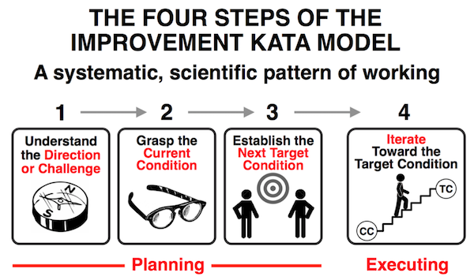

Every organization is constantly undergoing change. Therefore, some questions to
ask are:

-   What is the direction of that change?
-   What are the system-level outcomes you are working towards?
-   Is the organization better able to discover and serve its customers, and
    thus achieve its purpose?
-   Does the organization's business model and management of its people provide
    long-term sustainability?

When it seems as if things aren't going to plan, it's common for leaders to roll
out a transformation program. However, these programs often fail to achieve
their goals, using up large quantities of resources and organizational capacity.
This document examines how to successfully execute a transformation and
addresses some common sources of failure.

## How to implement transformation

There are two key ingredients in effective, ongoing transformation: processes
for executing organizational change by setting goals and enabling team
experimentation, and mechanisms to spread good practice through the
organization.

### Set goals and enable team experimentation

There are many frameworks for executing and measuring organizational change,
such as
[balanced scorecard](https://wikipedia.org/wiki/Balanced_scorecard),
[objectives and key results (OKRs)](https://rework.withgoogle.com/guides/set-goals-with-okrs/steps/introduction/),
and the
[improvement kata](http://www-personal.umich.edu/~mrother/The_Improvement_Kata.html)
and
[coaching kata](http://www-personal.umich.edu/~mrother/The_Coaching_Kata.html).
These frameworks might seem different, but they all share key features. The
basic dynamic is shown in the following figure, which is based on the
improvement kata framework:

Source: Reproduced by permission of Mike Rother, from [*Toyota Kata Practice
Guide: Practice Scientific Thinking Skills for Superior Results in 20 Minutes a
Day*](https://www.mheducation.com/highered/product/toyota-kata-practice-guide-practicing-scientific-thinking-skills-superior-results-20-minutes-day-rother/9781259861024.html)
by Mike Rother (McGraw-Hill 2018).

All of the frameworks start with a direction (a "true north") at the
organizational or division level. This is an aspirational, system-level business
goal set by
[leadership](/devops-capabilities/cultural/transformational-leadership).
It could be an ideal that can't be achieved, such as zero injuries (the
[goal](https://hbswk.hbs.edu/archive/paul-o-neill-values-into-action)
chosen by Alcoa's CEO Paul O'Neill). Or it could be a tough goal that is one to
three years out, such as a tenfold increase in productivity (the
[goal](https://continuousdelivery.com/evidence-case-studies/#the-hp-futuresmart-case-study)
chosen by Gary Gruver, when he was Director of Engineering of HP's LaserJet
Firmware division).

The next step is to understand the current condition. The
[DORA quick check](/quickcheck/)
can help you understand how you're doing in terms of your software development
capabilities and outcomes. Another analysis approach is to perform exercises
like
[value stream mapping](https://www.google.com/books/edition/Value_Stream_Mapping_How_to_Visualize_Wo/MeFrAAAAQBAJ),
or activity accounting. The point is to understand where the organization is in
measurable terms.

The third step is to set measurable targets for a future date. These targets
could be described using a format like OKRs, which begin with a qualitative
objective, and then specify measurable key results (target conditions). For
example, HSBC's CIO for Global Banking and Markets
[set every team the goal](https://www.linkedin.com/pulse/double-half-quarter-lesson-from-book-richard-david-knott/)
"to double, half and quarter every year: double the frequency of releases, half
the number of low impact incidents, and quarter the number of high impact
incidents."

Finally, teams experiment with ways to achieve these goals until the future date
is reached, supported by management. Teams take a scientific approach to
experimentation, using the
[PDCA method](https://wikipedia.org/wiki/PDCA)
(Plan-Do-Check-Act), also known as the Deming cycle. The cycle consists of the
following steps:

-   Plan: determine the expected outcome.
-   Do: perform the experiment.
-   Check: study the results.
-   Act: decide what to do next.

Teams should be running experiments on a daily basis to try to move towards the
target conditions or key results. In the
[improvement kata](http://www-personal.umich.edu/~mrother/The_Improvement_Kata.html),
everybody on the team should ask themselves the following five questions every
day:

1.  What is the target condition?
2.  What is the current condition?
3.  What obstacles do you think are preventing you from reaching the target
    condition? Which one are you addressing now?
4.  What is your next step? What outcome do you expect?
5.  When can the results be evaluated to see what can be learned from taking
    that step?

When the results have been captured and new targets are set, repeat the process.

Because the process is performed under conditions of uncertainty, it's not
always clear how the results will be achieved. Therefore, progress is often
nonlinear, as shown in the following diagram:

Source: CC-BY:
[*Lean Enterprise: How High Performance Organizations Innovate at Scale*](https://www.google.com/books/edition/Lean_Enterprise/G_ixBQAAQBAJ)
by Jez Humble, Joanne Molesky, and Barry O'Reilly (O'Reilly, 2014).

In the planning meetings, participants review the target conditions or key
results that were set in the last planning meeting. They then set new goals for
the next iteration. In review meetings, participants look at how well the teams
are achieving the goals for the iteration and discuss any obstacles and how they
will be addressed.

Some important points about this pattern are the following:

-   A team's own target conditions or
    [OKRs](https://rework.withgoogle.com/guides/set-goals-with-okrs/steps/introduction/)
    must be set by the team. If they are set in a top-down way, teams won't have
    a stake in the outcome and thus won't be as invested in achieving them.
    Instead, the team might "game" them—that is, manipulate the outcome to meet
    the goal artificially.
-   It's acceptable to not achieve the goals; some of the goals are *stretch
    goals*, meaning that they're purposely designed to be challenging. Teams
    should expect to achieve about 80% of the goals. It's common when starting
    with cultural transformation to not achieve *any* of the specified goals. If
    this happens, the team needs to set a single goal for the next iteration and
    dedicate everything to achieving it.
-   Many goals and measures will change from iteration to iteration as the
    team's goals and current conditions change, and as they learn through
    working towards their goals. Don't spend too much time trying to set the
    perfect objectives: focus on executing the process so you can start
    learning.
-   It's important for teams to have the necessary autonomy, capacity,
    resources, and management and
    [leadership support](/devops-capabilities/cultural/transformational-leadership)
    to do improvement work. Teams should not let the normal delivery work crowd
    out improvement work, because the improvement work is what will help fix the
    inefficiencies that make it so slow to deliver products and services.

### Build community structures to spread knowledge

After teams have discovered better ways of working, the next task is to spread
lessons learned throughout the organization. There are many ways to do this. In
the
[2019 State of DevOps Report](https://cloud.google.com/devops/state-of-devops)
researchers asked respondents to share how their teams and organizations spread
DevOps and Agile methods by selecting from one or more of the following
approaches (see Appendix B of the 2019 State of DevOps Report for detailed
descriptions):

-   Training center (sometimes referred to as a *dojo*)
-   Center of excellence (CoE)
-   Proof of concept (PoC) but stall
-   Proof of concept as a template
-   Proof of concept as a seed
-   Communities of practice
-   Big bang
-   Bottom-up or grassroots
-   Mashup

Analysis shows that high performers favor strategies that create community
structures at both low and high levels in the organization, likely making them
more sustainable and resilient to re-organizations and product changes. The top
two strategies employed are communities of practice and grassroots, followed by
proof of concept as a template (a pattern where the proof of concept gets
reproduced elsewhere in the organization), and proof of concept as a seed. For
an example of how a
[community of practice](https://www.youtube.com/watch?v=S4-huVFeQXg)
works, [read about how Google's culture of comprehensive unit testing was driven
by a group of
volunteers](https://martinfowler.com/articles/testing-culture.html#google).

Low performers tend to favor training centers and centers of excellence:
strategies that create more silos and isolated expertise. They also attempt
proofs of concept, but these generally stall and don't see success. Why might
these strategies fail to deliver effective change?

By centralizing expertise in one group, centers of excellence create several
problems. First, the CoE is now a bottleneck for the relevant expertise for the
organization and this cannot scale as demand for expertise in the organization
grows. Second, it establishes an exclusive group of "experts" in the
organization, in contrast to an inclusive group of peers who can continue to
learn and grow together. This exclusivity can chip away at healthy
organizational cultures. Finally, the experts are removed from doing the work.
They are able to make recommendations or establish generic "best practices" but
the path from the generic learning to the implementation of real work is left up
to the learners. For example, experts will build a workshop on how to
containerize an application, but they rarely or never actually containerize
applications. This disconnect between theory and hands-on practice will
eventually threaten their expertise.

While some see success in training centers, they require dedicated resources and
programs to execute both the original program and sustained learning. Many
companies have set aside incredible resources to make their training programs
effective: They have entire buildings dedicated to a separate, creative
environment, and staff devoted to creating training materials and assessing
progress. Additional resources are then needed to assure that the learning is
sustained and propagated throughout the organization. The organization has to
provide support for the teams that attended the training center, to help ensure
their skills and habits are continued back in their regular work environments,
and that old work patterns aren't resumed. If these resources aren't in place,
organizations risk all of their investments going to waste. Instead of a center
where teams go to learn new technologies and processes to spread to the rest of
the organization, new habits stay in the center, creating another silo, albeit a
temporary one. There are also similar limitations as in the CoE: If only the
training center staff (or other, detached "experts") are creating workshops and
training materials, what happens if they never actually do the work?

Mashups were commonly reported (40% of the people responding to the 2019 survey
used this strategy), but they lack sufficient funding and resources in any
particular investment. Without a strategy to guide a technology transformation,
organizations will often make the mistake of hedging their bets and suffer from
*death by initiative*: identifying initiatives in too many areas, which
ultimately leads to under-resourcing important work and dooming them all to
failure. Instead, it is best to select a few initiatives and dedicate ongoing
resources to ensure their success (time, money, and executive and champion
practitioner sponsorship). In contrast to mashups, very few people report use of
a big bang strategy, although it was most common in low performers.

Additional analysis identified four patterns used by high performers:

-   **Community builders:** This group focuses on communities of practice,
    grassroots, and proofs of concept (as a template and as a seed, as described
    earlier). This occurs 46% of the time.
-   **University:** This group focuses on education and training, with the
    majority of their efforts going into centers of excellence, communities of
    practice, and training centers. This pattern was only observed 9% of the
    time, suggesting that while this strategy can be successful, it is not
    common and requires significant investment and planning to ensure that
    lessons learned are scaled throughout the organization.
-   **Emergent:** This group has focused on grassroots efforts and communities
    of practice. This appears to be the most hands-off group and appears in 23%
    of cases.
-   **Experimenters:** Experimenters appeared in 22% of cases. This group has
    high levels of activity in all strategies except big bang and dojos—that is,
    all activities that focus on community and creation. They also include high
    levels in PoCs that stall. The fact they are able to leverage this activity
    and remain high performers suggests they use this strategy to experiment and
    test out ideas quickly.

## Principles of effective organizational change management

All organizations are complex, and every organization has different goals, a
different starting point, and their own ways of approaching challenges.
Prescriptions that work in one organization might not show the same results in
another organization. However, your organization can follow some general
principles in order to increase your chances of success.

### Improvement work is never done

High-performing organizations are never satisfied with their performance and are
always trying to get better at what they do. Improvement work is ongoing and
baked into the daily work of teams. People in these organizations understand
that failing to change is as risky as change, and they don't use "that's the way
we've always done it" as a justification for resisting change. However that
doesn't mean taking an undisciplined approach to change. Change management
should be performed in a scientific way in pursuit of a measurable team or
organizational goal.

### Leaders and teams agree on and communicate measurable outcomes, and teams determine how to achieve them

It's essential that everybody in the organization knows the measurable business
and organizational outcomes that they are working towards. These outcomes should
be short (a few sentences at most) at the organizational level, and match up
clearly to the purpose and mission of the organization. At the level of an
individual business unit, the outcomes should fit on a single page. The
organizational outcomes should be decided by leaders and teams working together,
although leaders have the ultimate authority. At lower levels of the
organization, goals are stated in more detail and with shorter horizons.

However, it should be up to teams to decide how they go about achieving these
outcomes, for these reasons:

-   Under conditions of uncertainty, it's impossible to decide the best course
    of action through planning alone. That doesn't mean some level of planning
    isn't important. But teams should be prepared to alter or even rewrite the
    plan based on what they discover when trying to execute it.
-   When people are told both what to do and how to do it, they lose their
    autonomy and a chance to harness their ingenuity. Not only does this produce
    worse outcomes, it also leads to disengaged employees.
-   Problem-solving is critical in helping employees develop new skills and
    capabilities. Organizations should give teams problems to solve, not tasks
    to execute.

### Large-scale change is achieved iteratively and incrementally

The annual budgeting cycle tends to drive organizations towards a project-based
model in which work of all kinds is tied to expensive projects that take a long
time to deliver. With few exceptions, it's better to break work down into
smaller pieces that can be delivered incrementally.
[Working in small batches](/devops-capabilities/process/working-in-small-batches)
delivers a host of benefits. The most important is that it lets organizations
correct course based on what they discover. This avoids wasting time and money
doing work that doesn't deliver the expected benefits.

Moving from a
[project paradigm to the product paradigm](https://itrevolution.com/book/project-to-product/)
is a long-term trend that will take most industries years to execute, but it's
clear that this is the future. Even the US federal government has successfully
[experimented with modular contracting](https://18f.gsa.gov/2019/04/09/why-we-love-modular-contracting/)
to pursue a more iterative, incremental approach to delivering large pieces of
work.

The issues that apply to delivering projects also apply to transformation.
Organizations should find ways to achieve quick wins, share learning, and help
other teams experiment with these new ideas.

## Common pitfalls in transforming culture

Leaders often make the following mistakes when they attempt to make large-scale
changes to an organization.

-   **Treating transformation as a one-time project**. in high-performing
    organizations, getting better is an ongoing effort and part of everybody's
    daily work. However, many transformation programs are treated as
    large-scale, one-time events in which everyone is expected to rapidly change
    the way they work and then continue on with business as usual. Teams are not
    given the capacity, resources, or authority to improve the way they work,
    and their performance gradually degrades as the team's processes, skills and
    capabilities become an ever poorer fit for the evolving reality of the work.
    You should think of technology transformation as an important value-delivery
    part of the business, one that you won't stop investing in. After all, do
    you plan to stop investing in customer acquisition or customer support?

-   **Treating transformation as a top-down effort**. In this model,
    organizational reporting lines are changed, teams are moved around or
    restructured, and new processes are implemented. Often, the people who are
    affected are given little control of the changes and are not given
    opportunities for input. This can cause stress and lost productivity as
    people learn new ways of working, often while they are still delivering on
    existing commitments. When combined with the poor communication that is
    frequent in transformation initiatives, the top-down approach can lead to
    employees becoming unhappy and disengaged. It's also uncommon for the team
    that's planning and executing the top-down transformation to gather feedback
    on the effects of their work and to make changes accordingly. Instead, the
    plan is executed regardless of the consequences.

-   **Failing to agree on and communicate the intended outcome**.
    Transformations are sometimes executed with poorly defined goals, or with
    qualitative (rather than quantitative) goals, such as "faster
    time-to-market" or "lower costs." Sometimes goals are defined but are not
    achievable, or the goals pit one part of the organization against the other.
    In these cases, it's impossible to know whether the improvement work is
    having the intended effect. When this failure is combined with a top-down
    approach, it becomes hard to experiment with other approaches that might be
    faster or cheaper. The result is typically waste when the plan is executed,
    and an inability to determine whether the goal was achieved or the program
    worked. In many cases, instead of the failure being critically analyzed and
    used as a learning opportunity, the failure is ignored and new wholesale
    change initiative is started or entire methodologies are discredited.

The combination of treating transformation as a project and treating it as a
top-down initiative tends to lead to the pattern shown in the following diagram.
Performance gradually degrades. At the start of a transformation program, it
initially gets worse before improving. But then this is followed by a transition
back to business as usual. All the while, cynicism and disengagement increases
across the organization.

Source: CC-BY:
[*Lean Enterprise: How High Performance Organizations Innovate at Scale*](https://www.google.com/books/edition/Lean_Enterprise/G_ixBQAAQBAJ)
by Jez Humble, Joanne Molesky, and Barry O'Reilly (O'Reilly, 2014).

## What's next

-   For links to other articles and resources, see the
    [DevOps page](https://cloud.google.com/devops).
-   Explore our DevOps
    [research program](https://www.devops-research.com/research.html).
-   Take the
    [DevOps quick check](/quickcheck/) to
    understand where you stand in comparison with the rest of the industry.