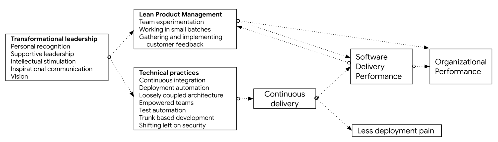

[DevOps Research and Assessment (DORA)](https://dora.dev) research shows that effective leadership has a measurable, significant
impact on software delivery outcomes. However, rather than driving these
outcomes directly, effective transformational leaders influence software
delivery performance by enabling the adoption of technical and product
management capabilities and practices by practitioners, which in turn drives the
outcomes leaders care about.

To study the role of leadership in DevOps transformations, DORA used a measure
of transformational leadership that includes five dimensions. According to this
model, validated in
[Dimensions of transformational leadership: Conceptual and empirical extensions](https://www.sciencedirect.com/science/article/pii/S1048984304000207)
(Rafferty, A. E., & Griffin, M. A.), the five characteristics of a
transformational leader are the following:

-   **Vision**: Understands clearly where their team and the organization
    are going, and where they want the team to be in five years.
-   **Inspirational communication**: Says positive things about the team;
    says things that make employees proud to be a part of their organization;
    encourages people to see changing conditions as situations full of
    opportunities.
-   **Intellectual stimulation**: Challenges team members to think about old
    problems in new ways and to rethink some of their basic assumptions about
    their work; has ideas that force team members to rethink some things that
    they have never questioned before.
-   **Supportive leadership**: Considers others' personal feelings before
    acting; behaves in a manner which is thoughtful of others' personal needs;
    sees that the interests of team members are given due consideration.
-   **Personal recognition**: Commends team members when they do a better
    than average job; acknowledges improvement in quality of team members'
    work; personally compliments team members when they do outstanding work.

These five characteristics of transformational leadership are highly correlated
with
[software delivery performance](/quickcheck/).
In fact, DORA observed statistically significant differences in leadership
characteristics between high-, medium- and low- performing software delivery
teams (see the
[2017 State of DevOps Report](https://services.google.com/fh/files/misc/state-of-devops-2017.pdf)
pp12-19). High-performing teams reported having leaders with the strongest
behaviors across all dimensions. In
contrast, low-performing teams reported the lowest levels of these leadership
characteristics.

What was most striking, however, was that teams with the least transformative
leaders (the bottom third) were also far less likely to be high performers at
software delivery — in fact, they were half as likely to exhibit high software
delivery performance. This validates common experience: Though there are many
DevOps and technology transformation success stories emerging from the
grassroots, it is far easier to achieve success when you have effective,
transformational leadership.

Moving beyond correlation to look at *how* effective transformational leaders
achieve results, the results are interesting. The DORA team created a predictive
model using a technique called
[structural equation modeling](https://wikipedia.org/wiki/Partial_least_squares_path_modeling)
to test the relationships between transformational leadership, a number of
technical and product management practices, and software delivery and
organizational performance. The validated model is shown in the following diagram. You can
read the arrows as *driving* or *impacting* the capabilities and outcomes to
which they point.

The validated model shows that effective leaders impact software delivery and
organizational performance *indirectly*, by enabling teams to adopt technical
practices and lean product management practices. It is these practices that
drive organizational outcomes such as higher software delivery performance and
organizational performance. These capabilities also drive cultural change, as
shown in the
[overall research program](/).

## How to implement transformational leadership

Transformational leadership can be contrasted with transactional leadership,
where employees are rewarded with money or prestige for complying with
leadership instructions or punished for failing to follow them.

However, transformational leaders, according to
[Rafferty and Griffin](https://www.sciencedirect.com/science/article/pii/S1048984304000207),
"motivate followers to achieve performance beyond expectations by transforming
followers' attitudes, beliefs, and values as opposed to simply gaining
compliance."

DORA's research found evidence that the presence of leaders with
transformational characteristics is not enough to achieve high performance.
Looking at teams whose leaders were in the top 10% in terms of transformational
leadership, the research found that they were not the very highest performers.
In fact, these teams displayed significant variation in levels of software
delivery performance.

This result can be explained by the observation that leaders cannot achieve
higher performance on their own. Success also depends on the implementation of
effective technical, management, and product management practices, along with
the other capabilities discussed in
DORA's[ research](https://devops-research.com/research.html).
It's essential that the transformational leadership behaviors, described above,
are directed towards the implementation of these capabilities.

Take vision as an example. One way to create a clear vision for a software
delivery team is to set measurable relative goals for
[software delivery performance](/quickcheck/).
[For example](https://www.linkedin.com/pulse/double-half-quarter-lesson-from-book-richard-david-knott/)
Richard Herbert, CIO for Global Banking at Markets of HSBC, set every team the
goal to "double the frequency of releases, half the number of low impact
incidents, and quarter the number of high impact incidents."

There may be significant obstacles to achieving goals like the ones set by
Richard Herbert. Again, leaders can use intellectual stimulation to help teams
identify and remove obstacles to achieving higher performance. Perhaps team
members believe that implementing [continuous testing](/devops-capabilities/technical/test-automation)
will help them, but they've
tried before and failed. Leaders can ask teams questions such as: "Why did it
fail last time?", "What lessons did you learn?", "What would you do differently
this time?", "What ideas would you like to try this time?".

Personal recognition is also important, and must be directed such that it
reinforces behaviors that help teams improve. Examples include trying
experiments even if they don't work, or taking time to help other teams
implement new ideas. Another example of effective personal recognition is
e-commerce company Etsy, which at its annual engineering conference
[gives an award](https://www.infoq.com/articles/crafting-resilient-culture/)
"to the engineer who inadvertently causes the most interesting or most
learning-filled incident."

It's crucial that these behaviors are demonstrated consistently, and
particularly when the team is under stress.

Finally, remember that leadership doesn't just mean executives and managers:
anybody can be a leader. Almost all of these behaviors can be practiced by
everybody in an organization. Consider how you can build them into your daily
interactions with other people in your organization.

## How to measure transformational leadership

Transformational leadership can be measured directly by asking team members
about the extent to which they believe leaders exhibit the behaviors
described.

The effects of transformational leadership are also measurable. For example, if
a leader does an outstanding job of defining and communicating their vision,
everybody in the organization should be able to describe that vision in a
consistent way without having to look it up.

## What's next
-   For links to other articles and resources, see the
    [DevOps page](https://cloud.google.com/devops).
-   Read [*Leadership and Performance Beyond Expectations*](https://books.google.com/books/about/Leadership_and_Performance_Beyond_Expect.html?id=NCd-QgAACAAJ) by Bernad M. Bass (Free Press, 1985.)
-   Check out the article [How to effectively execute transformations.](/devops-capabilities/cultural/devops-culture-transform)
-   Explore our DevOps
    [research program](https://www.devops-research.com/research.html).
-   Take the
    [DevOps quick check](/quickcheck/)
    to understand where you stand in comparison with the rest of the industry.