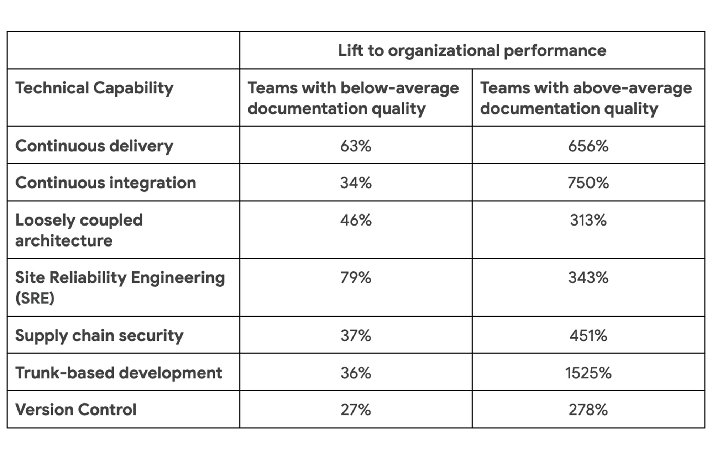

Internal documentation is a fundamental part of software development. For the past two years, the DORA team has looked at the quality of internal documentation. From our analysis, we’ve found a clear link between documentation quality and organizational performance — the organization’s ability to meet their performance and profitability goals. Just like a plant needs water and sunshine to thrive, an organization with good technical practices and documentation is significantly more likely to meet or exceed their performance goals.

Documentation is highly technical work, and our findings show just how much this work pays off. 

## Measuring documentation quality
For our research, we used a set of eight metrics that assess documentation attributes like clarity, findability, and reliability. You can review the [questions from 2022](http://localhost:1313/research/archives/2022/?tab_archives=questions) for the statements we used to assess these attributes.

## The impact of documentation
Similar to our research from 2021, we see documentation quality driving the implementation of every single technical practice we studied. [Our model from 2022](http://localhost:1313/research/archives/2022/?tab_archives=structural-equation-model) shows documentation underpinning these technical capabilities.

What may be more exciting, however, is how documentation quality interacts with these capabilities to impact organizational performance.

This interaction and impact applies to every single technical capability we studied in 2022. In the table below, check out the lift to organizational performance as various technical capabilities are implemented. The lift is significantly amplified for teams with above-average documentation quality.

## Creating quality documentation
Documentation needs to be actively created and maintained, which takes work.

For guidance from our research, you can review the [2021 State of DevOps Report](/publications/pdf/state-of-devops-2021.pdf) for practices that you can implement to improve documentation quality.

This research doesn’t investigate individual resources, but there are plenty out there to help you create useful documentation. In your own organization, you may have documentation guidelines and training. You may also have technical writers or other documentation champions to work with. Here at Google, our documentation resources include: 

- [Technical Writing Courses](https://developers.google.com/tech-writing) for software engineers

- [The Google developer documentation style guide](https://developers.google.com/style)

- The documentation chapter of [Software Engineering at Google](https://www.oreilly.com/library/view/software-engineering-at/9781492082781/)

If you’re lucky enough to work in an environment with plenty of quality documentation, it’s because you or people in your organization create that content. But if your organization has poor quality documentation, there’s good news. By implementing the practices linked above, you can improve your documentation quality and make it shine.

_Excerpted from [2022 State of DevOps Report data deep dive: Documenation is like sunshine](https://cloud.google.com/blog/products/devops-sre/deep-dive-into-2022-state-of-devops-report-on-documentation) by [Michelle Irvine](/research/team/#michelle-irvine) and [Derek DeBellis](/research/team/#derek-debellis)_