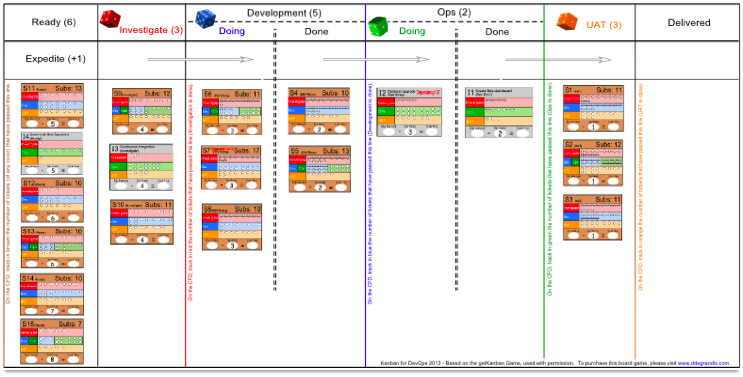

When faced with too much work and too few people to do it, rookie managers
assign people to work on multiple tasks in the hope of increasing throughput.
Unfortunately, the result is that tasks take longer to get done, and the team
burns out in the process.

Instead, you should do the following:

-   Prioritize work
-   Limit how much people work on
-   Focus on completing a small number of high-priority tasks

The manufacturing sector has a long history of limiting the amount of work in
process (WIP). Factories don't hold large amounts of inventory. Instead, when a
customer orders a product, parts are made in-house, on-demand or are pulled from
suppliers upstream as needed, and the company then assembles the product just in
time. When you implement this process correctly, you end up with shorter lead
times, higher quality, lower costs, and less waste.

## How to implement work in process limits

**Use a storyboard.** In technology, our inventory is invisible. There's no
shop floor with piles of work or assembly line where we can see the progression
of work. A simple way to see inventory is to write all the work the team is
doing on index cards and stick them on a board. In agile methods, this is called
creating a _storyboard_.

The following sample storyboard spans multiple functions (analysis, development,
testing, operations) and shows all work for a single product.

*(Source: "Kanban for Ops" board game, Dominica DeGrandis 2013")*

A common practice with storyboards is to ink a dot onto a card for every day the
card has been worked on. The team can easily see which work is blocked or taking
longer than it should.

**Specify limits.** For each column on the board, specify the WIP limit, or how
many cards can be in that column at one time. After the WIP limit is reached, no
more cards can be added to the column, and the team must wait for a card to move
to the next column before pulling the highest priority one from the previous
column.

Only by imposing WIP limits and following this pull-based process do you
actually create a Kanban board.

**Determine WIP limits by team capacity.** For example, if you have four pairs
of developers, don't allow more than four cards in the "in development" column.

**Stick to the limits.** WIP limits can result in teams sitting idle, waiting
for other tasks to be completed. Don't increase WIP limits at this point.
Instead, work to improve your processes to address the factors that are
contributing to these delays. For example, if you're waiting for an environment
to test your work, you might offer to help the team that prepares environments
improve or streamline their process.

## Common pitfalls with work in process limits

Organizations implementing WIP limits often encounter the following pitfalls:

-   **Not counting invisible work.** It's important to visualize the whole
    value stream from idea to customer, not just the portion of the work that
    the team is responsible for. Without doing this, it's impossible to see the
    actual bottlenecks, and you'll end up addressing problems that aren't
    actually significant constraints to the flow of work. (This is also known
    as local optimums.)
-   **Setting WIP limits that are much too big.** Make sure your WIP limits
    aren't too big. If your team is splitting their time between multiple tasks
    or projects, that's a good sign your WIP limits are too high.
-   **Relaxing WIP limits.** Don't relax your WIP limits when people are
    idle. Instead, those people should be helping in other parts of the value
    stream, addressing the problems that are leading to constraints elsewhere.
-   **Quitting while you're ahead.** If your WIP limits are easy to achieve,
    reduce them. The point of WIP limits is to expose problems in the system so
    they can be addressed. Another thing to look for is when there are too many
    columns on your visual display. Instead, look for ways to simplify the
    delivery process and reduce hand-offs. Process improvement work is key to
    increasing flow.

DevOps Research & Assessment
research shows that WIP limits help drive improvements in software delivery
performance, particularly when they are combined with
[the use of visual displays](/devops-capabilities/process/visual-management)
and
[feedback loops from monitoring](/devops-capabilities/process/monitoring-systems).

## Ways to improve work in process limits

-  **Make your work visible.** As you do this, try to surface all of your
    work, making all of it visible, to several teams and stakeholders. (See
    [visual displays](/devops-capabilities/process/visual-management)
    for details).
-  **Set WIP limits that match your team's capacity for work.**
    -   Account for activities like production support, meeting time
        and technical debt.
    -   Don't allow more WIP in any given part of the process than you
        have people to work on tasks.
    -   Don't require people to split their time between multiple tasks.
    -   When a particular piece of work is completed, move the card
        representing that work to the next column, and pull the highest
        priority piece of work waiting in the queue.
-  **Set up a weekly meeting for stakeholders to prioritize all work in
    order.** Let stakeholders know that if they don't attend, their work won't
    get done.
-  **Work to increase flow.** Measure the lead time of work through the
    system. Record the date that work started on a card and the date work
    ended. From this information, you can create a running frequency histogram,
    which shows the number of days work takes to go through the system. This
    data will allow you to calculate the mean lead time, as well as
    variability, with the goal of having low variability: high variability
    means you are not scoping projects well or have significant constraints
    outside of your team. High variability also means your estimates and
    predictions about future work will not be as reliable.
-  **Improve work processes.** Reduce hand-offs, simplify and automate
    tasks, and think about how to collaborate better to get work done. After
    you've removed some obstacles and things feel comfortable, reduce your WIP
    limits to reveal the next set of obstacles. The ideal is single-piece flow,
    which means that work flows from idea to customer with minimal wait time or
    rework. This ideal may not be achievable, but it acts as a "true north" to
    guide the way in a process of continuous improvement.

## Ways to measure work in process limits

WIP limits are something you impose rather than measure, but it's important to
keep finding ways to improve. During your regular retrospectives, ask the
following questions:

-   Do we know the mean lead time and variability for our entire value
    stream (from idea to customer)?
-   Are we finding ways to increase flow and thus reduce lead time for work?
-   Are our WIP limits surfacing obstacles that prevent us increasing flow?
-   Are we doing things about those obstacles?

## What's next

-   For links to other articles and resources, see the
    [DevOps page](https://cloud.google.com/devops).
-   Explore our DevOps
    [research program](/).
-   Take the
    [DevOps quick check](/quickcheck/)
    to understand where you stand in comparison with the rest of the industry.