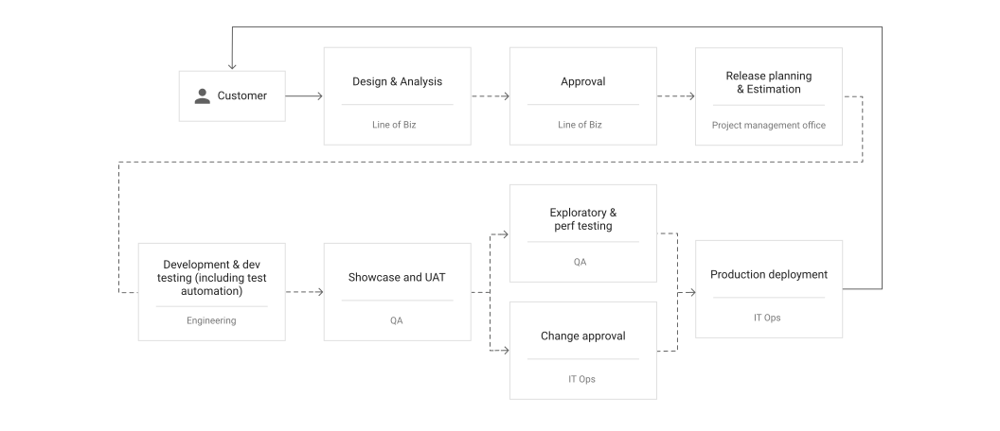
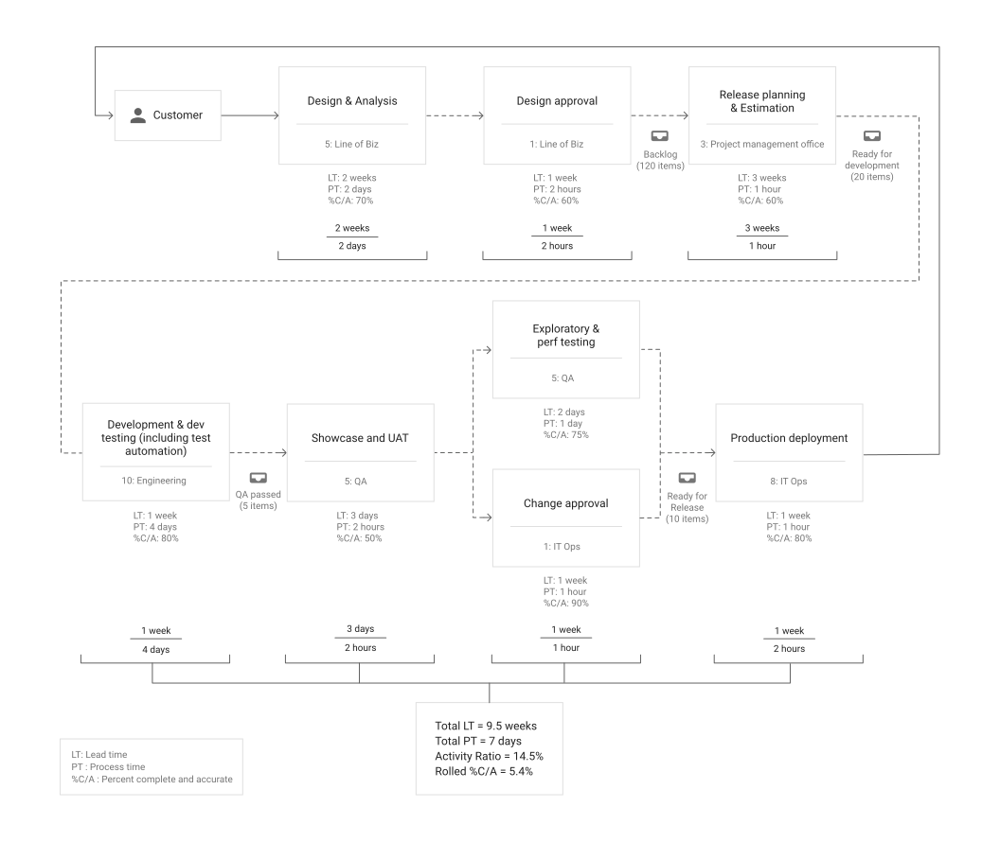
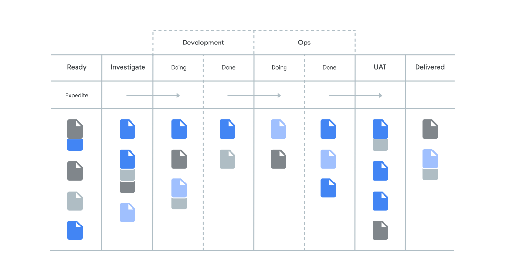

*Visibility of work* represents the extent to which teams have a good
understanding of the flow of work from the business all the way through to
customers, and whether they have visibility into this flow, including the status
of products and features. Visibility of work is part of a wider group of
capabilities that represent lean product management; these capabilities include
[working in small batches](/devops-capabilities/process/working-in-small-batches),
[team experimentation](/devops-capabilities/process/team-experimentation),
and
[visibility into customer feedback](/devops-capabilities/process/customer-feedback).
These capabilities predict both software delivery performance and organizational
performance (which is measured in terms of profitability, market share, and
productivity).

## How to implement work visibility

Teams that are proficient at this capability have the following
characteristics:

-   The team understands **how work moves** through the business from
    idea to customer, including products or features.
-   The team has visibility into the **flow of this work**.
-   The flow of work, including its current state, is **shown on visual
    displays** or dashboards.
-   **Information about the flow** of product development work across the
    whole value stream is readily available.

### Use value stream mapping to understand how work flows

Understanding how work moves through the product or feature development value
stream is an essential step in improving workflow. A useful technique is
[*value stream mapping*](https://books.google.com/books/about/Value_Stream_Mapping_How_to_Visualize_Wo.html?id=ll7imAEACAAJ)
(VSM). You can create a value stream map by gathering stakeholders from every
part of the product development value stream: the business line, design,
testing, QA, operations, and support. You break the value stream into 5 to 15
process blocks. In each block, you record the activity that's performed, along
with the team that performs it, as shown in the following diagram:

Source:
[*Lean Enterprise*](https://www.oreilly.com/library/view/lean-enterprise/9781491946527/)
(O'Reilly) by Jez Humble, Joanne Molesky, and Barry O'Reilly, 2014

Next, you analyze the state of work within the value stream, gathering the
information to determine barriers to flow. In particular, for each process
block, you measure the following key metrics:

-   **Lead time**: the time from the point a process accepts a piece of
    work to the point it hands that work off to the next downstream process.
-   **Process time**: the time it would take to complete a single item of
    work if the person performing it had all the necessary information and
    resources to complete it and could work uninterrupted.
-   **Percent complete and accurate (%C/A)**: the proportion of times that a
    process receives something from an upstream process that it can use without
    requiring rework.

You always record the state of the processes as they really are on the day the
exercise is performed. Make sure that you determine the actual metrics, not what
people would like the metrics to be.

The following diagram shows an example of the final output:

Source:
[*Lean Enterprise*](https://www.oreilly.com/library/view/lean-enterprise/9781491946527/)
(O'Reilly) by Jez Humble, Joanne Molesky, and Barry O'Reilly, O'Reilly, 2014.

Look for process blocks that produce poor quality work, which then require a
lot of downstream rework (reflected in a low %C/A in the downstream process
block), and for processes that have long lead times relative to the process
time.

It's important to work with stakeholders to create a future-state value stream
map that reflects the optimal state of the value stream at some future date (for
example, in 6 months to 2 years). Stakeholders should also agree to re-run the
exercise on a regular schedule (for example, every 6 months) to review the
current state and to review progress.

A detailed discussion of VSM is out of scope for this document; for more
information, we recommend
[*Value Stream Mapping: How to Visualize Work and Align Leadership for Organizational Transformation*](https://www.oreilly.com/library/view/value-stream-mapping/9780071828918/)
by Karen Martin and Mike Osterling.

### Visualize the current state of work

VSM can depict how work moves through the product development value stream from
idea to customer. But to get ongoing visibility into the flow of this work, you
need a more dynamic view. For software development, you can use a card wall, a
storyboard, or a Kanban board like the one shown in the following diagram.

Source: "Kanban for Ops" board game, Dominica DeGrandis, 2013.

Using visual displays such as this, and creating of WIP limits to manage flow,
are detailed in the articles on
[WIP limits](/devops-capabilities/process/wip-limits)
and
[visual management](/devops-capabilities/process/visual-management).

Finally, the mapping should include information about the responsibilities of
each team, along with statistical data on key metrics such as lead time, deploy
frequency, and %C/A.

## Common pitfalls with work visibility

Some common obstacles to implementing work visibility include the following:

-   **Overestimating the state of organizational knowledge**. In any
    organization, nobody has a good view into the whole value stream. When a
    company puts together a value stream mapping exercise, it's important to
    gather people from across the value stream to perform the exercise. There
    is often surprise as people find out what *actually* goes on in other parts
    of the organization.

-   **Failing to map the entire value stream**. It's important to map the
    complete value stream from idea (whether that's a line of business, the
    product marketing department, or internal customers) through to IT
    operations and the people who support the product or service being mapped.
    The increased visibility and alignment that results, along with the shared
    understanding, are extremely valuable. Failure to map the entire value
    stream can lead to local optimizations and missed opportunities to improve
    processes in key areas that have an impact on the entire organization.

-   **Focusing on the wrong areas for improvement**. Improving efficiency
    in areas that aren't bottlenecks won't have much impact on overall lead
    times, and can make things worse. Companies should of course improve in all
    areas, but there's no point in investing substantial effort in an effort
    that won't have organization-level outcomes.

-   **Not granting authority to make changes**. People involved in the
    effort must have the authority to make changes to achieve the future state.
    If these people must try to persuade others in the organization, the
    exercise is unlikely to succeed.

In addition, make sure you look at common obstacles in the articles on
[WIP limits](/devops-capabilities/process/wip-limits)
and
[visual management](/devops-capabilities/process/visual-management).
Many of them apply in this context too.

## Ways to improve work visibility

-   **Provide tools for visualizing and recording workflow**. Start with
    making sure the team has
    [visual management](/devops-capabilities/process/visual-management)
    displays that show their work and its flow through the part of the value
    stream that is closest to them, including both the upstream and downstream
    parts of the process. Record how long it takes work to get through the
    process, and how often rework must be performed because the team didn't get
    it right the first time. This will uncover your early and best
    opportunities for improvement at the team level.

-   **Create a value stream map**. Work with other teams to perform a
    value-stream mapping exercise to discover how work flows from idea to
    customer outcome, and report the VSM metrics (lead time, process time,
    %C/A) for each process block. Have the team prepare a future-state value
    stream map and work to implement it.

-   **Share artifacts**. Make sure the artifacts from these exercises are
    available to everyone in the organization, and that they are updated at
    least annually.

## Ways to measure work visibility

To determine the effectiveness of the team's visibility to the work in the
value stream, ask these questions:

-   Is there a current or recent value stream map available to anyone in
    the organization?
-   Does everybody in the organization have access to a visual display that
    shows what they're working on and the status of their work?
-   Are statistics on metrics such as lead time and %C/A available to the team?

## What's next

-   For links to other articles and resources, see the
    [DevOps page](https://cloud.google.com/devops).
-   Read the book
    [*Value Stream Mapping: How to Visualize Work and Align Leadership for Organizational Transformation*](https://www.oreilly.com/library/view/value-stream-mapping/9780071828918/),
    by Karen Martin and Mike Osterling.
-   Read the book
    [*Kanban: Successful Evolutionary Change for Your Technology Business*](https://books.google.com/books/about/Kanban.html?id=RJ0VUkfUWZkC),
    by David Anderson.
-   Explore our DevOps
    [research program](/).
-   Take the
    [DevOps quick check](/quickcheck/)
    to understand where you stand in comparison with the rest of the industry.