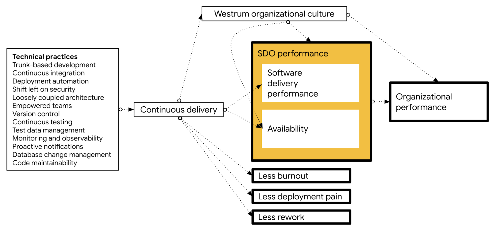

Continuous delivery is the ability to release changes of all kinds on demand
quickly, safely, and sustainably. Teams that practice continuous delivery well
are able to release software and make changes to production in a low-risk way at
any time—including during normal business hours—without impacting users.

You can apply the principles and practices of continuous delivery to any
software context, including the following:

-   Updating services in a complex distributed system.
-   Upgrading mainframe software.
-   Making infrastructure configuration changes.
-   Making database schema changes.
-   Updating firmware automatically.
-   Releasing new versions of a mobile app.

When your team practices continuous delivery, you can answer "yes" to the
following questions:

-   Is our software in a deployable state throughout its lifecycle?
-   Do we prioritize keeping the software deployable over working on new
    features?
-   Is fast feedback on the quality and deployability of the system we are
    working on available to everyone on the team?
-   When we get feedback that the system is not deployable (such as failing
    builds or tests), do we make fixing these issues our highest priority?
-   Can we deploy our system to production, or to end users, at any time, on
    demand?

Continuous delivery is commonly conflated with continuous deployment, but they
are separate practices. Continuous deployment is when teams try to deploy every
code change to production as soon as possible. Continuous deployment works well
for web services, but can't be applied to software such as firmware or mobile
apps. Continuous delivery is applied to all kinds of software including firmware
and mainframe systems, and  in highly regulated environments. You can and should
start with continuous delivery, even if you never intend to start using
continuous deployment.

Continuous delivery and continuous deployment are mistakenly viewed as risky
and not suited to regulated or safety critical domains. In fact, the goal of
continuous delivery is to reduce software risk, and DORA research has shown
consistently that high performers achieve higher levels of reliability and
availability. The technical practices that drive continuous delivery—continuous
testing, shifting left on security, and comprehensive testing and
observability—are even more important in highly regulated and safety-critical
domains. Continuous delivery has been successfully applied many times in highly
regulated domains such as financial services and government.

Although continuous delivery is possible for all kinds of software, it is hard
work. Nevertheless it provides significant benefits. [DevOps Research and Assessment (DORA)](https://cloud.google.com/devops) research shows that doing well at continuous delivery provides
the following benefits:

-   Improves software delivery performance, measured in terms of the
    [four key metrics](/quickcheck/),
    as well as higher levels of availability.
-   Leads to higher levels of quality, measured by the percentage of time
    teams spend on rework or unplanned work (as shown in the
    [2016 State of DevOps Report](/publications/pdf/state-of-devops-2016.pdf)
    pp25-26, and the
    [2018 State of DevOps Report](/publications/pdf/state-of-devops-2018.pdf)
    pp27-29).
-   Predicts lower levels of burnout (physical, mental, or emotional
    exhaustion caused by overwork or stress), higher levels of
    [job satisfaction](/devops-capabilities/cultural/job-satisfaction),
    and better
    [organizational culture](/devops-capabilities/cultural/generative-organizational-culture).
-   Reduces deployment pain, a measure of the extent to which deployments
    are disruptive rather than easy and pain-free, as well as the fear and
    anxiety that engineers and technical staff feel when they push code into
    production.
-   Impacts culture, leading to greater levels of [psychological safety](https://rework.withgoogle.com/print/guides/5721312655835136/) and a
    more [mission-driven organizational culture](/devops-capabilities/cultural/generative-organizational-culture).

The following diagram shows how a set of technical practices impacts
continuous delivery, which in turn drives the outcomes listed above:

Continuous delivery is only one aspect of driving the previously discussed
outcomes, albeit a critical one. Other cultural and organizational capabilities
discussed in the
[DORA research program](https://devops-research.com/research.html)
also help drive these outcomes. You can achieve continuous delivery by
implementing the technical practices described in this document.

## Implementing continuous delivery

DORA research found that the following technical capabilities drive the ability
to achieve continuous delivery. [Transformational leadership](/devops-capabilities/cultural/transformational-leadership) within the
organization also drives the implementation of many of these technical
capabilities.

To help your team get higher throughput and lower risk releases, implement the
following continuous delivery practices:

-   [Test automation](/devops-capabilities/technical/test-automation/):
    The use of comprehensive automated test suites primarily created and
    maintained by developers. Effective test suites are reliable—that is, tests
    find real failures and only pass releasable code.
-   [Deployment automation](/devops-capabilities/technical/deployment-automation/):
    The degree to which deployments are fully automated and do not require
    manual intervention.
-   [Trunk-based development](/devops-capabilities/technical/trunk-based-development/):
    Characterized by fewer than three active branches in a code repository;
    branches and forks having very short lifetimes (e.g., less than a day)
    before being merged into mainline; and application teams rarely or never
    having *code lock* periods when no one can check in code or do pull
    requests due to merging conflicts, code freezes, or stabilization phases.
-   [Shift left on security](/devops-capabilities/technical/shifting-left-on-security/):
    Integrating security into the design and testing phases of the software
    development process. This process includes conducting security reviews of
    applications, including the information security team in the design and
    demonstration process for
    applications, using pre-approved security libraries and packages, and
    testing security features as a part of the automated test suite.
-   [A loosely coupled architecture](/devops-capabilities/technical/architecture/):
    Architecture that lets teams test and deploy their applications on demand,
    without requiring orchestration with other services. Having a loosely
    coupled architecture allows your teams to work independently without
    relying on other teams for support and services, which in turn enables them
    to work quickly and deliver value to the organization.
-   [Empowering teams to choose tools](/devops-capabilities/technical/teams-empowered-to-choose-tools/):
    Teams that can choose which tools to use do better at continuous delivery.
    No one knows better than practitioners what they need to be effective.
-   [Continuous integration (CI)](/devops-capabilities/technical/continuous-integration/):
    A development practice where code is regularly checked in, and each
    check-in triggers a set of quick tests to discover regressions, which
    developers fix immediately. The CI process creates canonical builds and
    packages that are ultimately deployed and released.
-   [Continuous testing](/devops-capabilities/technical/test-automation/):
    Testing throughout the software delivery lifecycle rather than as a
    separate phase after *dev complete.* With continuous testing, developers
    and testers work side by side. High performers practice test-driven
    development, get feedback from tests in less than ten minutes, and
    continuously review and improve their test suites (for example, to better
    find defects and keep complexity under control).
-   [Version control](/devops-capabilities/technical/version-control/):
    The use of a version control system, such as Git or Subversion, for all
    production artifacts, including application code, application
    configurations, system configurations, and scripts for automating build and
    configuration of environments.
-   [Test data management](/devops-capabilities/technical/test-data-management/):
    Effective practices include having adequate data to run your test suite,
    the ability to acquire necessary data on demand, and the data not limiting
    the number of tests you can run. We caution that your teams should
    minimize, whenever possible, the amount of test data needed to run
    automated tests.
-   [Comprehensive monitoring and observability](/devops-capabilities/technical/monitoring-and-observability/): Allows teams to understand
    the health of their systems. Effective solutions enable teams to monitor
    predefined metrics, including system state as experienced by users, as well
    as allowing engineers to interactively debug systems and explore properties
    and patterns as they emerge.
-   [Proactive notifications](/devops-capabilities/process/proactive-failure-notification/):
    Monitoring system health so that teams can preemptively detect and mitigate
    problems.
-   [Database change management](/devops-capabilities/technical/database-change-management): Database changes don't slow teams down if
    they follow a few key practices, including storing database changes as
    scripts in version control (and managing these changes the same way as
    production application changes), making database changes visible to
    everyone in the software delivery lifecycle (including engineers), and
    communicating with all parties when changes to the application require
    database changes.
-   [Code maintainability](/devops-capabilities/technical/code-maintainability): Systems and tools that make it easy for developers
    to change code maintained by others, to find examples in the codebase, to
    reuse other people's code, and to add, upgrade, and migrate to new versions
    of dependencies without breaking their code.

While continuous delivery is often combined with continuous integration and
shortened to *CI/CD*, research shows that continuous integration is only one
element of implementing continuous delivery. To achieve reliable, low-risk
releases, you need close collaboration between everyone involved in the software
delivery process, not just software developers, and your team needs to adopt new
ways of working and learn new skills.

## Common pitfalls of implementing continuous delivery

Some organizations mistakenly believe that they can implement continuous
delivery by doing their existing deployment process more often. However,
implementing the technical capabilities that drive continuous delivery typically
requires significant process and architectural changes. Increasing the frequency
of deployments without improving processes and architecture is likely to lead to
higher failure rates and burned out teams.

Many descriptions of continuous delivery focus on the tooling and patterns,
such as the deployment pipeline that takes changes from version control to
production. However, using modern tooling without implementing the necessary
technical practices and process change described in this document won't produce
the expected benefits.

The following diagram shows the J curve that DORA research has found to be typical of
transformation programs. To emerge from the bottom of the J curve, your team
needs to include process redesign and simplification, architectural improvement,
and capability and skills development, along with automation and tooling.

In the diagram, the following stages are labeled:

-   At the beginning of the curve, teams begin transformation and identify
    quick wins.
-   In an initial improvement, automation helps low performers progress to
    medium performers.
-   In a decrease to efficiency—the bottom of the J curve—automation
    increases test requirements, which are dealt with manually. A large amount
    of technical debt blocks progress.
-   As teams begin to come out of the curve, technical debt and increased
    complexity cause additional manual controls and layers of process around
    changes, slowing work.
-   At the top of the curve, relentless improvement work leads to excellence
    and high performance. High and elite performers leverage expertise and
    learn from their environments to see increases in productivity.

A good way to mitigate the impact of the J-curve is to complete a *value
stream mapping* (VSM) exercise to discover and anticipate the effect of
bottlenecks. In a VSM exercise you look at a single change as it progresses from
version control to production:

1.  Consider the various processes each change goes through, such as
    automated and manual testing, security review, change management, and
    release to production.
1.  Measure the total time for the change to go from version control to
    released. For each process, measure the following:
    -   The actual elapsed time and the value-add time (the time during
        which work is actually being done) involved in executing the process end-to-end.
    -   The percentage of time that work is sent back because it was not
        done right the first time. This metric is known as *percentage complete
        and accurate*, or %C/A.

The purpose of the value stream mapping exercise is to help you find
inefficiencies in your process. As a team, create a diagram of how you want the
value stream to look in six months, and set aside team capacity to work on
implementing this future state. Identify and remove obstacles that have a
process with a long elapsed time compared to the value-add time or that have a
poor %C/A.

It is usually necessary to tackle significant process and architecture redesign
as part of implementing a deployment pipeline. Because the deployment pipeline
goes from check-in to release, it connects multiple teams. It's essential to
have representatives from all teams complete a value stream mapping exercise,
and to agree on a common toolchain and processes (for example for deployment
to testing and production environments) as part of your future state.

Implementing continuous delivery is a process of continuous, daily improvement
work, guided by the outcomes that you want to achieve. Tools and patterns are
valuable, but only in service to this essential improvement work.

## Measuring continuous delivery

Ultimately, the goal of continuous delivery is to ensure that releases are
performed in a low-risk way during normal business hours. The goal should be
that nobody has to work outside of regular business hours to perform deployments
or releases, so this is something that is important to measure.

How well you are doing at continuous delivery is reflected in the outcomes that
you achieve. You can take the
[DORA DevOps quick check](/quickcheck/)
to see how you're doing with the key continuous delivery metrics:

-   Short lead times for both regular and emergency changes, with a goal
    of using your regular process for emergency changes.
-   Low change fail rates.
-   Short time to restore service in the event of outages or service
    degradations.
-   Release frequencies that ensure that high-priority features and bug
    fixes are released in a timely manner.

As discussed at the start of this document, implementing continuous delivery
should also lead to lower levels of rework, reduced deployment pain, and less
time spent doing rework and unplanned work.

## What's next

-  For links to other articles and resources, see the
    [DevOps page](https://cloud.google.com/devops).
-  Learn more about continuous delivery in Martin Fowler's
    [Software delivery guide](https://martinfowler.com/delivery.html).
-   Read [*Value Stream Mapping: How to Visualize Work and Align Leadership for Organizational Transformation*](https://books.google.com/books/about/Value_Stream_Mapping_How_to_Visualize_Wo.html?id=ll7imAEACAAJ) by Karen Martin and Mike Osterling.
-   Explore our DevOps
    [research program](/).
-   Take the
    [DevOps quick check](/quickcheck/)
    to understand where you stand in comparison with the rest of the industry.