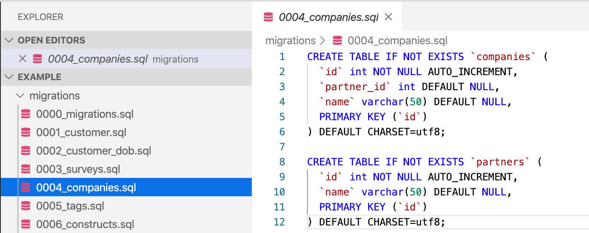
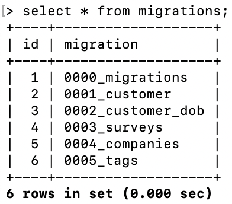

Database changes are often a major source of risk and delay when performing
deployments. [DevOps Research and Assessment (DORA)](https://dora.dev) investigated which database-related practices help during the process of implementing continuous delivery, improving both software delivery performance and availability.

DORA's research found that integrating database work into the software delivery
process positively contributes to
[continuous delivery](/devops-capabilities/technical/continuous-delivery).
But how can your teams improve your database delivery as part of implementing
continuous delivery? A few practices predict performance outcomes.

DORA discovered that good communication and comprehensive configuration
management that includes the database matter. Teams that do well at continuous
delivery store their database changes as scripts in version control and manage these
changes in the same way they manage production application changes. Furthermore, when
changes to the application require database changes, these teams discuss them
with the people responsible for the production database, and ensure the
engineering team has visibility into the progress of pending database changes.

When teams follow these practices, database changes don't slow them down or
cause problems when they perform code deployments.

## How to implement database change management

There are two aspects to implementing effective database change management:
cultural and technical. This section discusses both.

### Establish effective communication of database changes

Research shows that teams do best when they discuss changes with the people
responsible for managing the production database, and when everyone has
visibility into the progress of pending database changes.

Discussing proposed changes with production database administrators (DBAs) is
important for a few reasons. First, these experts can advise on how best to
achieve results, and point out potential issues such as performance problems.
(Many operations have very different performance characteristics in production
systems when compared to developer workstations). This discussion also gives
DBAs insight into what is happening upstream, which helps them better prepare
for the impact of upcoming changes.

Making sure everybody has visibility into the progress of changes is also
crucial so that teams, including DBAs, can understand which changes are coming up,
their testing status, and which schema changes have made it to the various
production and non-production shared databases. You can facilitate visibility
by:

-  Keeping all database schema changes in version control, together with
    the application code the schema belongs to;
-  Using a tool that records which changes have been run against which
    environments, and what the results were.

These practices also ensure that there is
a canonical source of truth for all changes, and makes the history of changes
easy to access for auditing purposes.

### Treat all database schema changes as migrations

A widely used pattern for versioning database changes is to capture every
change as a migration script which is kept in version control, as shown in
the following diagram. Each migration script has a unique sequence number,
so that you know in which order to apply migrations.

You then ensure that every database instance has a table that records which
migrations have been run against that particular instance. In this way you version-control the database schema, so you can use a tool to apply the migration scripts to take the
database to the schema version you want. Examples of tools include:

-  [migrate](https://github.com/golang-migrate/migrate)
(Go)
-  [alembic](https://pypi.org/project/alembic/)
(Python)
-  [Active Record Migrations](https://guides.rubyonrails.org/active_record_migrations.html)
(Ruby on Rails)
-  [dbup](https://github.com/dbup/dbup)
(.NET)
-  [Entity Framework Migrations](https://docs.microsoft.com/en-us/ef/core/managing-schemas/migrations/)
(.NET)
-  [Laravel Migrations](https://laravel.com/docs/7.x/migrations)
(PHP)
-  [Flyway](https://flywaydb.org/)
(platform-independent)
- [Liquibase](https://www.liquibase.org/)
(platform-independent)

You can also use migrations to
create empty database schemas for development and testing.

As shown in the following diagram, every database instance has a table that
records which migrations you have run against that instance. Then you can perform
updates automatically
using a tool or script which executes migrations that have not already been
applied against the database instance, updating the migrations table after each
one successfully completes.

You can manage database changes in the same way you manage application changes:
through an automated process that uses version control as its source of truth.

### Zero-downtime database changes

Many organizations schedule downtime for their services when making database
schema changes due to the need to coordinate them with application deployments,
or due to database table locking during the execution of such changes.
Continuous delivery aims to eliminate downtime for deployments, so here are some
strategies to make database schema changes without downtime:

-   **Use an online schema migration framework** such as
    [gh-ost](https://github.com/github/gh-ost)
    or
    [pt-online-schema-change](https://www.percona.com/doc/percona-toolkit/3.0/pt-online-schema-change.html).
    These tools create a "ghost" copy of each table you want to change, migrate
    the empty copy, and then incrementally copy data from the original table
    including any updates that happen during the migration. After this process
    is complete, they replace the original table with the ghost. Some
    databases, for example [Cloud Spanner](https://cloud.google.com/spanner/docs/schema-updates), can perform schema updates with zero downtime.
-   **Decouple database changes and application changes** with the
    [parallel change pattern](https://medium.com/continuousdelivery/expand-contract-pattern-and-continuous-delivery-of-databases-4cfa00c23d2e).
    In this pattern, you never mutate existing database objects. Instead, you
    add new structures alongside old ones. For example, consider changing a
    column for "address" to two columns: `address_1` and `address_2`.

    Instead of deleting the old column and adding the new one, and
    rolling out a new version of the application at the same time, you add the
    new columns but keep the old ones. You can do this before the application
    deployment occurs. Then the new version of the application can look for the
    new columns, reading from them if they are present and not null, otherwise
    reading from the old column. The application can then write to both old and
    new columns, lazily migrating the data, and also allowing for application
    rollback without requiring a database rollback.

    In this way the application deployment is decoupled from the database
    change, which can typically be made without incurring downtime since it
    doesn't involve migrating data. We have traded off some additional
    complexity in the application in order to reduce deployment pain.
    Alternatively, database triggers can be used to keep data in new and old
    columns synchronized.

-   **Design and implement a data partitioning and archiving strategy**. A
    major cause of long migrations is database tables with a large number of
    rows. Make sure your applications are designed to allow for partitioning
    and archiving of data to avoid tables growing too large. One example of
    this would be to create multiple instances of a table for each quarter, for
    example, instead of a `survey_answers` table, you might have
    `survey_answers_2020Q1`, `survey_answers_2020Q2` and so forth. Make sure
    application design and architecture reviews include validating the
    application's data partitioning / archiving strategy.
-   **Use an event sourcing architecture**. In an
    [event sourcing architecture](https://microservices.io/patterns/data/event-sourcing.html),
    rather than having the database storing the current state of the
    application, we have it store *changes* to its state instead, in the form
    of a log of events known as *commands*. So when your customer changes their
    address, rather than updating a table with the customer details, the
    application issues an address change command which is stored in the
    database. This is how database transaction logs and version control work,
    and is a common pattern in distributed systems. In an event sourced
    architecture, events can be queued allowing database migrations to happen
    while events queue up. Events in the queue can then be flushed to the
    database once the migration is complete. Some databases are able to queue
    queries while schema migrations run, which can be effective if migrations
    complete quickly enough.
-   **Use a NoSQL solution.** Some NoSQL databases, such as
    [Firestore](https://firebase.google.com/docs/firestore)
    and
    [Cloud BigTable](https://cloud.google.com/bigtable),
    don't suffer from the issue of downtime created by schema changes. Document
    databases like Firestore have an implicit schema, which means that the
    schema is managed at the application layer rather than the database layer.
    However there are trade-offs associated with using NoSQL databases: they
    are not optimal for every application.

As well as eliminating scheduled downtime, you also want to avoid unscheduled
downtime. Make sure you test every schema change against a
[production-like data set](/devops-capabilities/technical/test-data-management)
(with any personal or confidential information scrubbed, of course) to make sure
your application behaves the way you expect during and after migration. Some
organizations create a scrubbed version of their  production database on a daily
schedule to use for this purpose. If you are using a database management system
with more than one node in production, make sure you're testing against an
instance with at least two nodes to help catch distributed system issues.

## Common pitfalls of implementing database change management

There are a few common pitfalls to be aware of when implementing the key
practices described here.

First, many organizations are heavily siloed. Often DBAs work on their own
separate team which uses its own process to manage changes. When software
delivery teams implement a new process for managing database changes without
consulting the DBA team they are likely to face resistance to using their new
process to make changes to databases managed by the DBA team. This can
substantially reduce the benefits of moving to a new process.

The first step is to get together with them to discuss how to achieve the
objectives presented in this article. It is important to get their buy-in to any
proposed process and technology changes. The best way to do this is to ask them
what problems they are facing, see how the ideas presented in this article can
help them address these problems, and offer to help out. Ideally delivery teams
and DBAs can find a mutually acceptable solution.

This obstacle is often exacerbated by another pitfall: the common situation
where multiple applications share the same database schema. This means that
teams working on one application cannot alter the schema without potentially
impacting other applications. This requires that a single solution be put in
place to manage database changes for all applications sharing the database
schema. It is certainly possible, and indeed even more beneficial, to implement
a version-controlled, self-service mechanism to deploy database changes in this
situation. However, it involves careful planning and rollout.

Finally, implementing both migration-based database change management and
zero-downtime deployments can involve significant
[architectural change](/devops-capabilities/technical/loosely-coupled-architecture).
This should be taken into consideration when estimating the effort required to
implement these practices.

## How to measure database change management

The goal of an effective database change management system is that database
changes don't slow down deployments or cause problems. It's worth measuring the
percentage of failed changes in which database changes were a contributing
factor, and the extent to which work related to database changes contributes
towards overall lead time from version control to release.

If database changes require scheduled downtime, this is also an important
consideration. To measure the economic impact of scheduled downtime, consider
both the potential lost revenue resulting from downtime and the salary costs of
paying people to work out of regular hours in order to perform deployments.
Deploying outside of business hours can also contribute to team burnout. These
impacts can be used to justify the work required to implement the solutions for
zero-downtime deployments discussed in this document.

In terms of measuring the level of automation, consider the proportion of
database changes that are made in a push-button way using a fully automated
process. The goal should be that 100% of database changes are made in this way.

## What's next

-  For links to other articles and resources, see the
    [DevOps page](https://cloud.google.com/devops).
-   Read about
    [evolutionary database design](https://www.martinfowler.com/articles/evodb.html).
-   Read about
    [zero downtime database migration and replication to and from Cloud Spanner](https://medium.com/@chbussler/zero-downtime-database-migration-and-replication-to-and-from-cloud-spanner-99ad0c654d12)
-   Find out more about
    [Google Cloud's database solutions](https://cloud.google.com/solutions/databases).
-   Recommended books:
    -   [*Database Reliability Engineering*](http://shop.oreilly.com/product/0636920039761.do) by Laine Campbell and Charity Majors.
    -   [*Refactoring Databases*](https://books.google.com/books/about/Refactoring_Databases.html?id=puBQAAAAMAAJ) by Scott W. Ambler and Pramod J. Sadalage
-   Explore our DevOps
    [research program](/).
-   Take the
    [DevOps quick check](/quickcheck/)
    to understand where you stand in comparison with the rest of the industry.