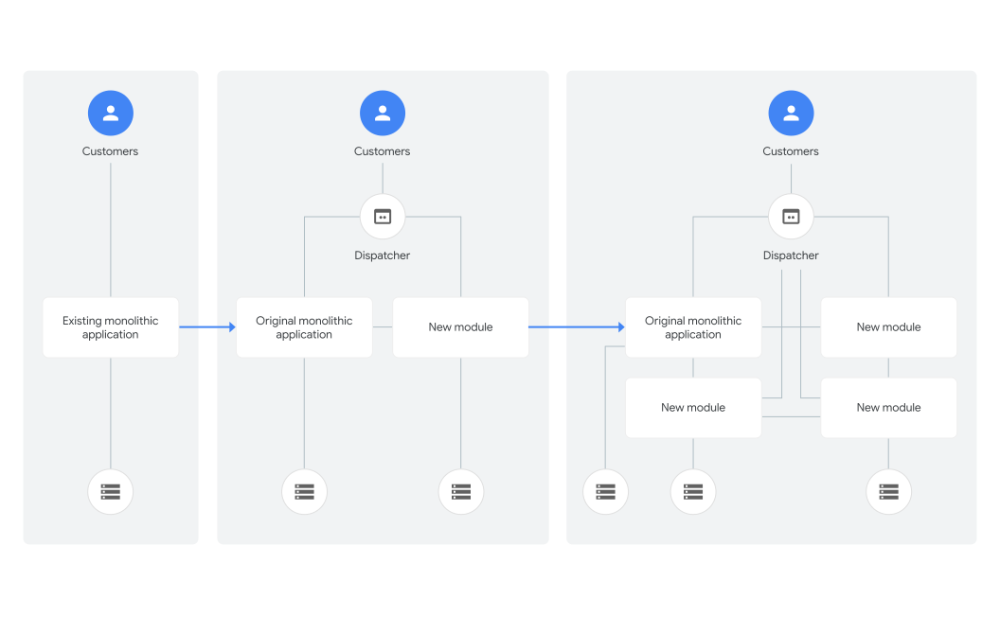
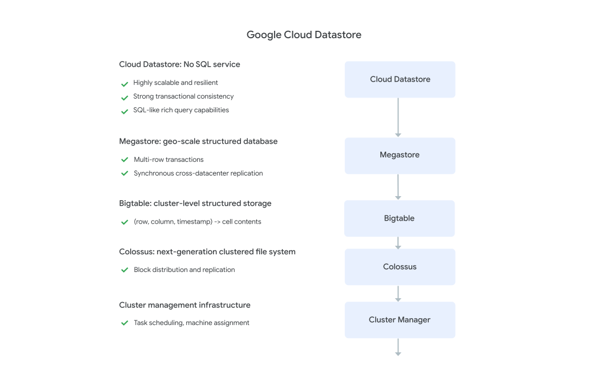

Research from the [DevOps Research and Assessment (DORA)](https://dora.dev) team shows that
architecture is an important predictor for achieving continuous delivery.
Whether you're using Kubernetes or mainframes, your architecture enables teams
to adopt practices that foster higher levels of software delivery performance.

When teams adopt continuous delivery practices, adopting the following
architectural practices drives successful outcomes:

-   Teams can make large-scale changes to the design of their systems
    without the permission of somebody outside the team or depending on other teams.
-   Teams are able to complete work without needing fine-grained
    communication and coordination with people outside the team.
-   Teams deploy and release their product or service on demand,
    independently of the services it depends on or of other services that
    depend on it.
-   Teams do most of their testing on demand, without requiring an
    integrated test environment.
-   Teams can deploy during normal business hours with negligible downtime.

It's possible to achieve these outcomes with mainframe technologies. It's also
possible to fail to achieve them even when using the latest, most trendy
technologies. Many organizations invest lots of time and effort in adopting
technologies, but fail to achieve critical software delivery outcomes, due to
limitations imposed by architecture.

When the architecture of the system is designed to enable teams to test, deploy,
and change systems without dependencies on other teams, teams require little
communication to get work done. In other words, both the architecture and the
teams are loosely coupled.

This connection between communication bandwidth and systems architecture was
first discussed by Melvin Conway, who said, "organizations which design systems
... are constrained to produce designs which are copies of the communication
structures of these organizations." To counteract tightly-coupled architectures
and help support better communication patterns, teams and organizations can use
the
[Inverse Conway Maneuver](https://medium.com/better-practices/how-to-dissolve-communication-barriers-in-your-api-development-organization-3347179b4ecc),
whereby team structures and patterns are designed to promote the expected
architectural state. In this way, team communication patterns support and
enforce the architectural patterns that are built.

With a tightly coupled architecture, small changes can result in large-scale,
cascading failures. As a result, anyone working in one part of the system must
constantly coordinate with anyone else working in another part of the system,
including navigating complex and bureaucratic change management processes.

Microservices architectures are supposed to enable these outcomes, as should any
true service-oriented architecture. In practice, many so-called service-oriented
architectures don't permit testing and deploying services independently of each
other, and thus won’t let teams achieve higher software delivery performance.
It's essential to be strict about these outcomes when implementing
service-oriented and microservice architectures.

## How to implement architectures for continuous delivery

Consider the major architectural archetypes. Randy Shoup, formerly an
Engineering Director for App Engine and VP of Engineering at WeWork,
observed the following:

> "There is no one perfect architecture for all products and all
scales. Any architecture meets a particular set of goals or range of
requirements and constraints, such as time to market, ease of developing
functionality, scaling, etc. The functionality of any product or service will
almost certainly evolve over time—it should not be surprising that our
architectural needs will change as well. What works at scale 1x rarely
works at scale 10x or 100x."

Given the pros and cons of architectural archetypes, each fits a different
evolutionary need for an organization.

<table>
<thead>
<tr>
<th width="25%">Archetype</th>
<th>Pros</th>
<th>Cons</th>
</tr>
</thead>
<tbody>
<tr>
<td><strong>Monolithic v1</strong> 
(all functionality in one application)</td>
<td><ul><li>Simple at first</li>
<li>Low interprocess latencies</li>
<li>Single codebase, one deployment unit</li>
<li>Resource-efficient at small scales</li>
</ul>
</td>
<td><ul><li>Coordination overhead increases as team grows</li>
<li>Poor enforcement of modularity</li>
<li>Poor scaling</li>
<li>All-or-nothing deploy (downtime failures)</li>
<li>Long build times</li>
</ul>
</td>
</tr>
<tr>
  <td><strong>Monolithic v2</strong> 
(set of monolithic tiers: frontend presentation,
application server, database layer)</td>
<td><ul><li>Simple at first</li>
<li>Join queries are easy</li>
<li>Single schema deployment</li>
<li>Resource-efficient at small scales</li>
</ul>
</td>
<td><ul><li>Tendency for increased coupling over time</li>
<li>Poor scaling and redundancy (all or nothing, vertical only)</li>
<li>Difficult to tune properly</li>
<li>All-or-nothing schema management</li>
</ul>
</td>
</tr>
<tr>
  <td><strong>Microservice</strong> 
(modular, independent, graph relationship or tiers,
isolated persistence)</td>
<td><ul><li>Each unit is simple</li>
<li>Independent scaling and performance</li>
<li>Independent testing and deployment</li>
<li>Can optimally tune performance (caching, replication, etc.)</li>
</ul>
</td>
<td><ul><li>Many cooperating units</li>
<li>Many small repos</li>
<li>Requires more sophisticated tooling and dependency management</li>
<li>Network latencies</li>
</ul>
</td>
</tr>
</tbody>
</table>

As the table shows, a monolithic architecture that supports a lean product
development effort (for example, rapid prototyping of new features, and
potential pivots or large changes in strategies) is different from an
architecture that needs hundreds of teams of developers, each of whom must be
able to independently deliver value to the customer. By allowing the
architecture to evolve, you can ensure that your architecture always serves the
current needs of the organization. Regardless of the archetype, when
architecting to facilitate continuous delivery, teams must be empowered to
achieve the capabilities discussed in the introduction to this document.

Building cross-functional teams, with representation from across the
organization (product, dev, test, and operations) enables teams to work
independently and facilitates building around team boundaries. When your teams
are cross-functional, they can function autonomously,
[experiment with ideas](/devops-capabilities/process/team-experimentation),
and
[choose their own tools](/devops-capabilities/technical/teams-empowered-to-choose-tools).
To help with cross-team communication and testing, it can be helpful to
have well-defined contracts between services.

Team independence is important, as is the independence of their products
and services. Services need to be testable on demand. Adopting techniques
around
[mocking and stubbing](https://martinfowler.com/bliki/TestDouble.html)
of external services helps reduce the impact of external dependencies and
lets teams quickly create test environments. Also, implementing
[contract testing](https://martinfowler.com/bliki/ContractTest.html)
of external services helps ensure that dependencies on their service or
other services are still met. To truly achieve continuous delivery, an
individual team's product or service must be independently acceptance
tested and deployed from the services it depends on.

To enable deploy-anytime capabilities, consider implementing blue/green or
rolling deployment models, with high degrees of
[automation](/devops-capabilities/technical/deployment-automation).
With these models, at least two or more versions of the product or service
are running simultaneously. These deployment models allow teams to validate
changes and deploy to production with little or no downtime. An important
consideration is how data upgrades are performed, meaning data and schema
must be done in a backward-compatible manner.

In order to aid the independent deployment of components, we recommend that
you create backward-compatible versioned APIs. Ensuring backward
compatibility for APIs adds complexity to systems, but the flexibility you
gain in terms of ease of deployment pays for the added complexity many
times over.

Service-oriented and microservice architectures enable these capabilities
because they use
[bounded contexts](https://martinfowler.com/bliki/BoundedContext.html)
and APIs as a way to decouple large domains into smaller, more loosely
coupled units and the use of test doubles and virtualization as a way to
test services or components in isolation.

## Common pitfalls in architectures

-   **Simultaneously releasing many services**. In teams where testability
    and deployability are not prioritized, most testing requires the use of
    complex and expensive integrated environments. In many cases, deployments
    require that you simultaneously release many services due to complex
    interdependencies. These "big-bang" deployments require teams to
    orchestrate their work, with many hand-offs and dependencies between
    hundreds or thousands of tasks. Big-bang deployments typically take many
    hours or even days, and require scheduling significant downtime.

-   **Integrating changes with the changes from hundreds, or even
    thousands, of other developers**. Those developers, in turn, might have
    dependencies on tens, hundreds, or thousands of interconnected systems.
    Testing is done in scarce integration test environments, which often
    require weeks to obtain and configure. These environments are typically not
    representative of production, reducing the value and accuracy of the
    testing. The result is not only long lead times for changes (typically
    measured in weeks or months) but also low developer productivity and poor
    deployment outcomes.

-   **Creating bottlenecks in the software delivery process**. Example
    bottlenecks could be a single team that many others rely on either from a
    manual process standpoint (testing, deployment, and so on) or from a
    service operation standpoint. In both examples, those bottlenecks create
    single points of failure and demand that those teams or services scale to
    meet the demands of the many dependent teams.

## Ways to improve your architecture

With an architecture that enables small teams of developers to independently
implement, test, and deploy code into production safely and quickly, you can
increase developer productivity and improve deployment outcomes. A
key feature of service-oriented and microservice architectures is that they're
composed of loosely coupled services with bounded contexts. One popular set of
patterns for modern web architecture based on these principles is the
[twelve-factor app](https://12factor.net/).

Randy Shoup observed the following:

> "Organizations with these types of service-oriented
architectures, such as Google and Amazon, have incredible flexibility and
scalability. These organizations have tens of thousands of developers where
small teams can still be incredibly productive."

In many organizations, services are distinctly hard to test and deploy. Rather
than re-architecting everything, we recommend an iterative approach to improving
the design of your enterprise system. This approach is known as *evolutionary
architecture*. In this method, it's given that successful products and services
will require re-architecting during their lifecycle due to the changing
requirements placed on them.

One valuable pattern in this context is the *strangler fig application*. In this
pattern, you iteratively replace a monolithic architecture with a more
componentized one by ensuring that new work is done following the principles of
a service-oriented architecture. You accept that the new architecture might well
delegate to the system it is replacing. Over time, as more and more
functionality is performed in the new architecture, the old system is
"strangled."

Product and service architectures continually evolve. There are many ways to
decide what should be a new module or service, and the process is iterative.
When deciding whether to make a piece of functionality into a service, consider
if it has the following traits:

-   Implements a single business function or capability.
-   Performs its function with minimal interaction with other services.
-   Is built, scaled, and deployed independently from other services.
-   Interacts with other services by using lightweight communication
    methods, for example, a message bus or HTTP endpoints.
-   Can be implemented with different tools, programming languages, data
    stores, and so on.

Moving to microservices or a service-oriented architecture also changes many
things through the organization as a whole. In his
[platform rant](https://gist.github.com/chitchcock/1281611/9621c8859db00bf08b98212a109fa2dec4c6d601),
Steve Yegge presents several critical lessons learned from moving to a SOA:

-   Metrics and monitoring become more important and escalations become
    more difficult because an issue surfaced in one service could be from a
    service many service calls away.
-   Internal services can produce Denial of Service (DOS) type problems, so
    quotas and message throttling are important in every service.
-   QA and monitoring begin to blend, because monitoring must be
    comprehensive and must exercise the business logic and data of the service.
-   When there are many services, having a service-discovery mechanism
    becomes important for efficient operation of the system.
-   Without a universal standard for running a service in a debuggable
    environment, debugging issues in other people's services is much harder.

## Case study: Datastore

A tightly coupled architecture can impede everyone's productivity and ability
to safely make changes. In contrast, a loosely coupled architecture promotes
productivity and safety with well-defined interfaces that enforce how modules
connect with each other. A loosely coupled architecture lets small and
productive teams make changes that can be deployed safely and independently. And
because each service also has a well-defined API, it enables easier testing of
services and the creation of contracts and service level agreements (SLAs)
between teams.

Randy Shoup describes this architecture as follows:

> "This type of architecture has served Google extremely well, for
a service like Gmail, there's five or six other layers of services underneath
it, each very focused on a very specific function. Each service is
supported by a small team, who builds it and runs their functionality, with
each group potentially making different technology choices. Another example
is the { service, which is one of the largest NoSQL
services in the world, and yet it is supported by a team of only about
eight people, largely because it is based on layers upon layers of
dependable services built upon each other."

This kind of service-oriented architecture allows small teams to work on
smaller and simpler units of development that each team can deploy
independently, quickly, and safely.

## Ways to measure architectural improvement

Whether on a mainframe or in microservices, facilitating the practices required
for architectural improvement is essential for improving software delivery
performance (increased deployment frequency with reduced lead time for changes,
time to restore service, and change failure rate). As your services and products
become less tightly coupled, your deployment frequency should increase. When
measuring improvement, consider using deployment rate rather than just count,
because deployment count naturally increases as services are added. Lastly, you
should see a reduction in time to detect and recover from problems and in the
time for changes to reach production.

Aside from taking these deployment and service measures, teams that operate
more independently demonstrate improvements in
[job satisfaction](/devops-capabilities/cultural/job-satisfaction)
and
[team experimentation](/devops-capabilities/process/team-experimentation),
and tend to select different technologies and tools based on their needs.

## What's next

-   For links to other articles and resources, see the
    [DevOps page](https://cloud.google.com/devops).
-   Explore our DevOps
    [research program](/).
-   Take the
    [DevOps quick check](/quickcheck/)
    to understand where you stand in comparison with the rest of the industry.