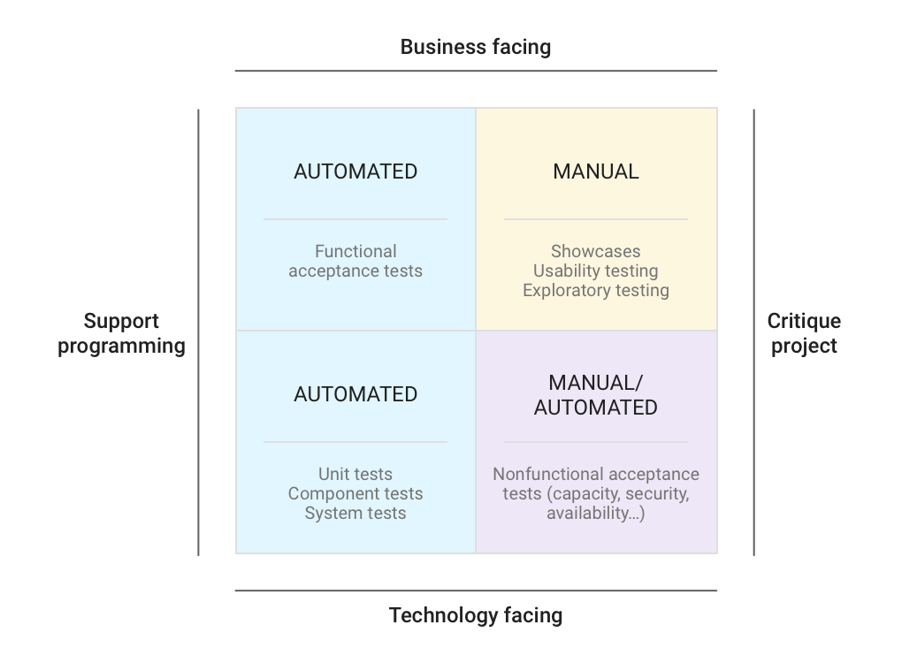
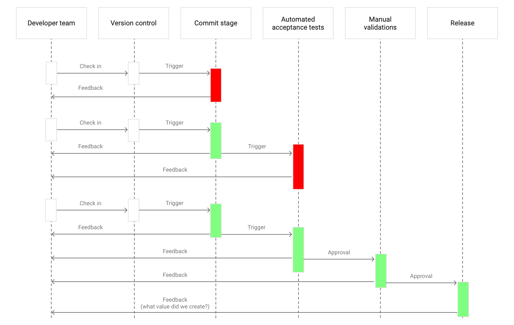
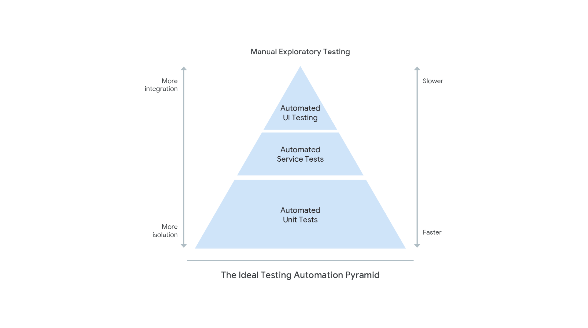

The key to building quality into software is getting fast feedback on the impact
of changes throughout the software delivery lifecycle. Traditionally, teams
relied on manual testing and code inspection to verify systems' correctness.
These inspections and tests typically occurred in a separate phase after "dev
complete." This approach has the following drawbacks:

-   Manual regression testing is time-consuming to execute and expensive to
    perform, which makes it a bottleneck in the process. Software can't be
    released frequently and developers can't get quick feedback.
-   Manual tests and inspections are not reliable, because people are poor at
    repetitive tasks like manual regression tests, and it is hard to predict the
    impact of changes on a complex software system through inspection.
-   Once software is "dev complete", developers have to wait a long time to get
    feedback on their changes. This usually results in substantial work to
    triage defects and fix them. Performance, security, and reliability problems
    often require design changes that are even more expensive to address when
    discovered at this stage.
-   Long feedback cycles also make it harder for developers to learn how to
    build quality code, and under schedule pressure development teams can
    sometimes treat quality as "somebody else's problem".
-   When developers aren't responsible for testing their own code it's hard for
    them to learn how to write testable code.
-   For systems that evolve over time, keeping test documentation up to date
    requires considerable effort.

Instead, teams should:

-   Perform all types of testing continuously throughout the software delivery
    lifecycle.
-   Create and curate fast, reliable suites of automated tests which are run as
    part of your
    [continuous delivery pipelines](https://continuousdelivery.com/implementing/patterns/#the-deployment-pipeline).

Not only does this help teams build (and learn how to build) high quality
software faster, DORA's research shows that it also drives improved software
stability, reduced team burnout, and lower deployment pain.

## How to implement automated testing

To build quality into the software, you must continually run both automated and
manual tests throughout the delivery process to validate the functionality and
architecture of the system under development. This discipline has both an
organizational and a technical component. Organizationally, DORA's research
finds that teams do better when they:

-   Allow testers to work alongside developers throughout the software
    development and delivery process. (Note that "tester" is a role, not
    necessarily a full-time job, although this is a common pattern discussed
    below.)
-   Perform manual test activities such as exploratory testing, usability
    testing, and acceptance testing throughout the delivery process.

A key technical activity is building and maintaining a set of automated test
suites, including:

-   **Unit tests**. These typically test a single method, class, or function in
    isolation, providing assurance to developers that their code operates as
    designed. To ensure that the code is testable and tests are maintainable,
    write your unit tests before writing code, a technique known as
    [test-driven development](http://www.jamesshore.com/v2/books/aoad1/test_driven_development)
    (TDD).
-   **Acceptance tests**: These typically test a running app or service (usually
    with dependencies replaced by
    [test doubles](https://testing.googleblog.com/2013/07/testing-on-toilet-know-your-test-doubles.html))
    to provide assurance that a higher level of functionality operates as
    designed and that regression errors have not been introduced. Example
    acceptance tests might check for the business acceptance criteria for a user
    story or the correctness of an API. Write these tests as part of the
    development process. No one should be able to declare their work "dev
    complete" unless automated acceptance tests are passing.

The following diagram,
[initially created by Brian Marick](http://www.exampler.com/old-blog/2003/08/22/#agile-testing-project-2)
and later referenced in the book
[*Agile Testing: A Practical Guide for Testers and Agile Teams*](https://books.google.com/books/about/Agile_Testing.html?id=68_lhPvoKS8C),
shows the types of automated and manual tests to run.

The automated tests highlighted in the preceding diagram fit in a
[continuous delivery](/devops-capabilities/technical/continuous-delivery)
[deployment pipeline](https://continuousdelivery.com/implementing/patterns/#the-deployment-pipeline).
In such pipelines, every change runs a build that creates software packages,
executes unit tests, and possibly performs other checks, such as static
analysis. After these packages pass the first stage, more comprehensive
automated acceptance tests, and likely some nonfunctional tests such as
performance tests and vulnerability scans, run against automatically deployed
running software. Any build that passes the acceptance stage is then typically
made available for manual exploration and usability testing. Finally, if no
errors are found in these manual steps, the app is considered releasable.

Running tests continuously as part of a pipeline contributes to quick feedback
for developers, a short lead time from check-in to release, and a low error rate
in production environments. Developers have most of their work validated in a
matter of minutes, instead of days or weeks, so they can fix bugs as soon as
possible.

The following diagram shows an example of a simple linear deployment pipeline.
In this example, green means no problems were found, and red means that one or
more problems were discovered.

In the deployment pipeline pattern, every change creates a release candidate and
the quick feedback loop helps to catch problems as early in the process as
possible. When a package reaches the end of the pipeline and the team still
doesn't feel comfortable with releasing it, or if they discover defects in
production, the pipeline must be improved, perhaps by adding or updating tests.

## Common pitfalls

-   **Not having developers involved in testing.** DORA's research shows that
    when developers are primarily responsible for creating and maintaining
    suites of automated tests, and when it is easy for developers to fix
    acceptance test failures, this drives improved performance. When other
    groups own the test automation, two problems often arise:

    -   **Test suites are frequently in a broken state**. Code changes might
        require tests to be updated. If developers are not responsible for test
        automation, the build pipeline stays broken until the responsible team
        fixes the tests.
    -   **Developers write code that is hard to test.** Developers tend to solve
        the problem they are given without thinking about how it will be tested.
        This can lead to poorly designed code and expensive, hard-to-maintain
        test suites.

    Testers and QA teams continue to have an important role in this way of
    working. Testers have a unique perspective on the system because they
    understand how users interact with it. It's a good practice to pair testers
    with developers to create and evolve the suites of automated tests, using
    screen sharing tools if teams are not physically colocated. This way, they
    can learn from each other and solve problems in real time. Testers also play
    an essential role performing exploratory testing and usability testing, as
    well as helping to curate test suites.

-   **Failing to curate your test suites.** Make sure you continuously review
    and improve your test suites to better find defects and keep complexity and
    cost under control. For example:

    -   Acceptance test suites should typically represent real
        [end-to-end](https://testing.googleblog.com/2016/09/testing-on-toilet-what-makes-good-end.html)
        user journeys through the system, rather than just collections of
        automated acceptance criteria. As your product evolves, so will these
        scenarios, and the test suites validating them. For more information on
        this process, see the video
        [Setting a Foundation For Successful Test Automation](https://www.youtube.com/watch?v=qYfI2-bC6LA)
        by Angie Jones.
    -   If every time you change your code you must also change multiple unit
        tests, you're probably
        [over-relying on mocking](https://martinfowler.com/articles/mocksArentStubs.html),
        or failing to prune your unit test suite.
    -   Keep your test suites well-factored. If every change to your UI causes
        multiple acceptance tests to fail, use the
        [page object pattern](https://martinfowler.com/bliki/PageObject.html)
        to decouple your tests from the system under test.
    -   If your tests are expensive to maintain, this could point to problems
        with your software's
        [architecture](/devops-capabilities/technical/loosely-coupled-architecture). Make sure
        you continue to invest in making your software easy to test, including
        incorporating
        [refactoring](https://refactoring.com/)
        into your team's daily work.

-   **Having the wrong proportion of unit and acceptance tests.** A specific
    design goal of an automated test suite is to find errors as early as
    possible. This is why faster-running unit tests run before slower-running
    acceptance tests, and both are run before any manual testing.

    You should find errors with the fastest category of test. When you find an
    error in an acceptance test or during exploratory testing, add a unit test
    to make sure this error is caught faster, earlier, and cheaper next time.
    Mike Cohn described the ideal
    [test automation pyramid](https://books.google.com.br/books?id=8IglA6i_JwAC&printsec=frontcover&dq=Mike+Cohn+Succeeding+with+Agile&hl=pt-BR&sa=X&ved=0ahUKEwj9x8S8tuTiAhWjGLkGHU0GCxEQ6AEILTAA#v=onepage&q=Mike%20Cohn%20Succeeding%20with%20Agile&f=false),
    shown in the following diagram, where most of the errors are caught using
    unit testing.

    

-   **Tolerating unreliable tests.** Tests should be reliable: that is, when the
    tests pass we should be confident the software is releasable, and test
    failures should indicate a real defect. In particular, don't tolerate flaky
    tests.
    [Read about Google's mitigation strategy for flaky tests](https://testing.googleblog.com/2016/05/flaky-tests-at-google-and-how-we.html).

## Ways to improve test automation

If your organization doesn't yet have a culture of unit testing by developers,
don't worry. Unit testing wasn't a widespread practice at Google in its early
years. The current culture of comprehensive unit testing was driven by a group
of volunteers at Google called the Testing Grouplet.
[Read how they helped drive the adoption of unit testing](https://martinfowler.com/articles/testing-culture.html#google)
by building a community of practice focused on propagating testing knowledge
throughout Google and persuading developers of the value of unit testing.

If you don't have enough test automation, get started by building a skeleton
deployment pipeline. For example, create a single unit test, a single
acceptance test, and an automated deployment script that stands up an
exploratory testing environment, and thread them together. Then incrementally
increase test coverage and extend your deployment pipeline as your product or
service evolves.

If you're already working on a
[brownfield system](https://wikipedia.org/wiki/Brownfield_\(software_development\)),
follow the guidance in this article, but don't stop to retrofit a comprehensive
suite of automated tests. Instead, write a small number of acceptance tests for
the high-value functionality. Then, make sure you require developers to write
unit and acceptance tests for any new functionality, and any functionality you
are changing. Consider using TDD to improve the quality and maintainability of
both main and test code, and finally, ensure that when your acceptance tests
break, you write unit tests to discover the defect faster in the future.

If you have a test suite that is expensive to maintain and unreliable, don't be
afraid to prune it down. A test suite of ten tests that is reliable, fast, and
trustworthy is much better than a test suite of hundreds of tests that is hard
to maintain and that nobody trusts.

## Ways to measure automated testing

You can measure the results of automated testing in your environment by doing
the following:

<table>
<thead>
<tr>
<th>Factor to test</th>
<th>What to measure</th>
<th>Goal</th>
</tr>
</thead>
<tbody>
<tr>
<td>Writers of acceptance and unit tests.</td>
<td>Percentage of tests written by developers, testers, and any other group in
your company.</td>
<td>Primary authors and maintainers of acceptance tests are developers.</td>
</tr>
<tr>
<td>Number of bugs found in acceptance testing, exploratory testing, and in production.</td>
<td>Change in proportion of bugs found over time.</td>
<td>More bugs are found in "cheaper" test phases, teams add automated tests
for the bugs you find during exploratory testing and production, and add unit tests to catch bugs discovered in acceptance tests..</td>
</tr>
<tr>
<td>Time spent fixing acceptance test failures.</td>
<td>Change in time spent fixing test failures over time. (It should
reduce.)</td>
<td>Developers can easily fix acceptance test failures.</td>
</tr>
<tr>
<td>Automated tests are meaningful.</td>
<td>Track the quantity of automated test failures that represent a real defect
and the quantity which were poorly coded.</td>
<td>Test failures always indicate a real defect in the product.</td>
</tr>
<tr>
<td>Automated tests run on delivery pipeline.</td>
<td>Check (yes/no) whether all test suites run in every pipeline trigger.</td>
<td>Automated tests are run as part of the main pipeline and workflow.</td>
</tr>
</tbody>
</table>

## What's next

-   For links to other articles and resources, see the
    [DevOps page](https://cloud.google.com/devops).
-   Find out more about testing at Google by reading
    [Software Engineering at Google](https://books.google.com/books/about/Software_Engineering_at_Google.html?id=WXTTDwAAQBAJ).
-   Learn how to continuously build, test, and deploy your system using
    [Cloud Build](https://cloud.google.com/build/?&utm_source=google&utm_medium=cpc&utm_campaign=latam-BR-all-pt-dr-skws-all-all-trial-e-dr-1003997-LUAC0008680&utm_content=text-ad-none-none-DEV_c-CRE_325592090632-ADGP_SKWS+%7C+Multi+%7E+Dev+%7C+Build-KWID_43700040482196107-kwd-471794162766-userloc_1001743&utm_term=KW_cloud%20build-ST_Cloud+Build&gclid=Cj0KCQjw6IfoBRCiARIsAF6q06suRucypheWE5dDKAmsKDZrEVvuY0nDFS0YgbkN5XVmkEzJPl89zIIaAoJcEALw_wcB&gclsrc=aw.ds).
-   Learn how to monitor your system and tests using
    [Cloud Monitoring](https://cloud.google.com/stackdriver).
-   Explore our DevOps
    [research program](/).
-   Take the
    [DevOps quick check](/quickcheck/)
    to understand where you stand in comparison with the rest of the industry.
