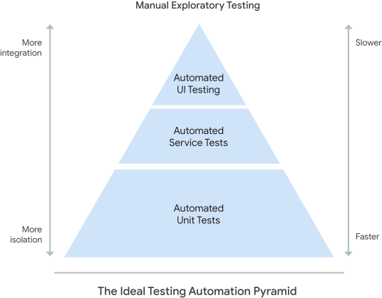

[Automated testing](/devops-capabilities/technical/test-automation)
is a key component of modern software delivery practices. The ability to execute
a comprehensive set of unit, integration, and system tests is essential to
verify that your app or service behaves as expected, and can be safely deployed
to production. To ensure that your tests are validating realistic scenarios,
it's critical to supply the tests with realistic data.

Test data is important because it's required by all kinds of tests throughout
your test suite, including manual and automated tests. Good test data lets you
validate common or high value user journeys, test for edge cases, reproduce
defects, and simulate errors.

However, it's hard to use and manage test data effectively. Over-reliance on
data defined outside of test scope can make your tests brittle and increase
maintenance costs. Dependencies on external data sources can introduce delays
and impact test performance. Copying production data introduces risk because it
might contain sensitive information. To address these challenges, you need to
manage your test data carefully and strategically.

## How to implement test data management

Analysis done by
[DevOps Research and Assessment (DORA)](https://cloud.google.com/devops)
shows that successful teams approach test data management with the following
core principles:

-   Adequate test data is available to run full automated test suites.
-   Test data for automated test suites can be acquired on demand.
-   Test data does not limit or constrain the automated tests that teams can
    run.

To improve test data management processes, strive to meet each of these
conditions in all of your development teams. These practices can also positively
contribute to your overall
[test automation](/devops-capabilities/technical/test-automation)
and
[continuous integration](/devops-capabilities/technical/continuous-integration)
capabilities.

## Common pitfalls in test data management

Managing test data can be hard. The following pitfalls are common in test data
management:

-   Over-reliance on data in testing. In particular, unit tests should not
    depend on data or state external to the test.
-   Using a full copy of the production database, rather than identifying
    relevant or important portions.
-   Not masking or hashing sensitive data.
-   Relying on data that is out of date or no longer relevant.

## Ways to improve test data management

The following practices can help you use test data more effectively and
efficiently:

1.  **Favor unit tests**. Unit tests should be independent of each other and
    any other part of the system except the code being tested. Unit tests
    should not depend on external data. As defined by the
    [test automation pyramid](https://martinfowler.com/articles/practical-test-pyramid.html#TheTestPyramid),
    unit tests should make up the majority of your tests. Well-written unit
    tests that run against a well-designed codebase are much easier to triage
    and cheaper to maintain than higher-level tests. Increasing the coverage of
    your unit tests can help minimize your reliance on higher-level tests that
    consume external data.

    

1.  **Minimize reliance on test data**. Test data requires careful and
    ongoing maintenance. As your APIs and interfaces evolve, you must update or
    re-create related test data. This process represents a cost that can
    negatively impact team velocity. Hence, it's good practice to minimize the
    amount of test data needed to run automated tests.
1.  **Isolate your test data**. Run your tests in well-defined environments
    with controlled inputs and expected outputs that can be compared to actual
    outputs. Make sure that data consumed by a particular test is explicitly
    associated with that test, and isn't modified by other tests or processes.
    Wherever possible, your tests should create the necessary state themselves
    as part of setup, using the application's APIs. Isolating your test data is
    also a prerequisite for tests to run in parallel.
1.  **Minimize reliance on test data stored in databases**. Maintaining test
    data stored in databases can be particularly challenging for the following
    reasons:
    1.  **Poor test isolation**. Databases store data durably; any
        changes to the data will persist across tests unless explicitly reset.
        Less reliable test inputs make test isolation more difficult, and can
        prevent parallelization.
    1.  **Performance impact**. Speed of execution is a key requirement
        for automated tests. Interacting with a database is typically slower
        and more cumbersome than interacting with locally stored data. Favor
        in-memory databases where appropriate.
1.  **Make test data readily available**. Running tests against a copy of a
    full production database introduces risk. It can be challenging and slow to
    get the data refreshed. As a result, the data can become out of date.
    Production data can also contain sensitive information. Instead, identify
    relevant sections of data that the tests require. Export these sections
    regularly and make them easily available to tests.

## How to measure test data management

As your approach to test data management evolves, it's important to measure
your progress against the core principles outlined earlier.

1.  **Adequate test data is available to run full automated test suites**.
    You can measure this by tracking how much time developers and testers spend
    managing and manipulating data for use in test suites. You can also capture
    this by perceptual measures (that is, surveys) to ask teams if they have
    adequate data for their work, or if they feel this is a constraint for them.
1.  **Test data for automated test suites can be acquired on demand**. You
    can measure this as the percentage of key data sets that are available, how
    often those data sets are accessed, and how often they are refreshed.
1.  **Test data doesn't limit or constrain the automated tests that teams
    can run**. You can measure this as the number of automated tests that can
    be run without the need to acquire additional test data. You can also
    capture this with perceptual measures (that is, surveys), to ask teams if
    they feel that test data limits their automated testing activities.

## What's next

-   For links to other articles and resources, see the
    [DevOps page](https://cloud.google.com/devops).
-   See how testing and CI/CD can help
    [keep bugs out of production](https://cloud.google.com/blog/products/application-development/release-with-confidence-how-testing-and-cicd-can-keep-bugs-out-of-production).
-   Explore our DevOps
    [research program](/).
-   Take the
    [DevOps quick check](/quickcheck/)
    to understand where you stand in comparison with the rest of the industry.