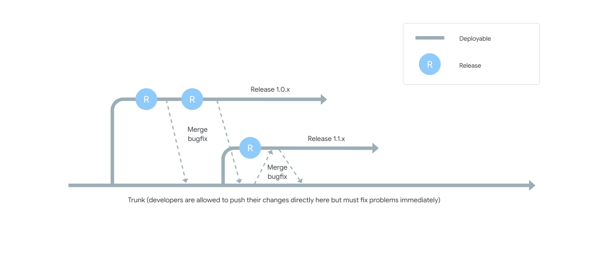
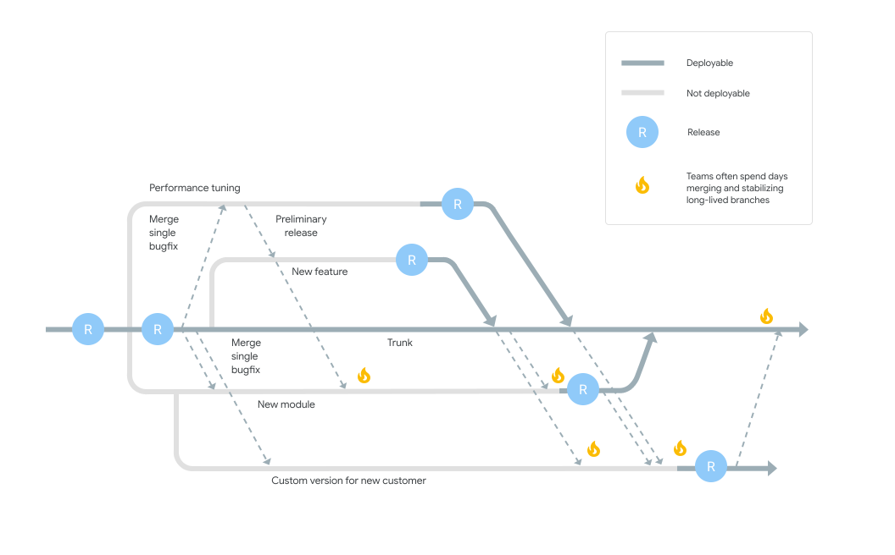

There are two main patterns for developer teams to work together using version
control. One is to use *feature branches*, where either a developer or a group
of developers create a branch usually from trunk (also known as *main* or
*mainline*) and then work in isolation on that branch until the feature they are
building is complete. When the team considers the feature ready to go, they
merge the feature branch back to trunk.

The second pattern is known as *trunk-based development*, where each developer
divides their own
[work into small batches](/devops-capabilities/process/working-in-small-batches)
and merges that work into trunk at least once (and potentially several times) a
day. The key difference between these approaches is scope. Feature branches
typically involve multiple developers and take days or even weeks of work. In
contrast, branches in trunk-based development typically last no more than a few
hours, with many developers merging their individual changes into trunk
frequently.

The following diagram shows a typical trunk-based development timeline:

In trunk-based development, developers push code directly into trunk. Changes
made in the release branches—snapshots of the code when it's ready to be
released—are usually merged back to trunk (depicted by the downward arrows) as
soon as possible. In this approach, there are cases where bug fixes must be
cherry picked and merged into releases (depicted by the upward arrow), but these
cases are not as frequent as the development of new features in trunk. In cases
where releases happen multiple times a day, release branches are not required at
all, because changes can be pushed directly into trunk and deployed from there.
One key benefit of the trunk-based approach is that it reduces the complexity of
merging events and keeps code current by having fewer development lines and by
doing small and frequent merges.

In contrast, the following diagram shows a typical non-trunk-based
development style:

In this approach, developers make changes to long-lived branches. These changes
require bigger and more complex merge events when compared to trunk-based
development. This approach also requires additional stabilizing efforts and
"code lock" or "code freeze" periods to make sure the software stays in a
working state, because large merges frequently introduce bugs or regressions. As
a result, you must test the post-merge code thoroughly and often have to make
bug fixes.

## How to implement trunk-based development

Trunk-based development is a required practice for
[continuous integration](/devops-capabilities/technical/continuous-integration).
Continuous integration (CI) is the combination of practicing trunk-based
development and maintaining a suite of fast automated tests that run after each
commit to trunk to make sure the system is always working.

The point of using continuous integration is to eliminate long integration and
stabilization phases by integrating small batches of code frequently. In this
way, developers ensure they are communicating what they are doing, and the
integration gets rid of big merges that can create substantial work for other
developers and for testers.

In the CI paradigm, developers are responsible for keeping the build process
*green*—that is,  up and running. This means that if the CI process fails,
developers must stop what they're doing either to fix the problem immediately or
to revert the change if it can't be fixed in a few minutes.

Practicing trunk-based development requires in turn that developers understand
how to
[break their work up into small batches](/devops-capabilities/process/working-in-small-batches).
This is a significant change for developers who aren't used to working in this
way.

Analysis of DevOps Research and Assessment (DORA) data from
[2016](/publications/pdf/state-of-devops-2016.pdf#page=31)
(PDF) and
[2017](/publications/pdf/state-of-devops-2017.pdf#page=40)
(PDF) shows that teams achieve higher levels of software delivery and operational
performance (delivery speed, stability, and availability) if they follow these
practices:

-   Have three or fewer active branches in the application's code repository.
-   Merge branches to trunk at least once a day.
-   Don't have code freezes and don't have integration phases.

## Common pitfalls

Some common obstacles to full adoption of trunk-based development include the
following:

-   **An overly heavy code-review process**. Many organizations have a
    heavyweight code review process that requires multiple approvals before
    changes can be merged into trunk. When code review is laborious and takes
    hours or days, developers avoid working in small batches and instead batch
    up many changes. This in turn leads to a downward spiral where reviewers
    procrastinate with large code reviews due to their complexity.

    Consequently, merge requests often languish because developers avoid
    them. Because it is hard to reason about the impact of large changes on a
    system through inspection, defects are likely to escape the attention of
    reviewers, and the benefits of trunk-based development are diminished.

-   **Performing code reviews asynchronously**. If your team practices pair
    programming, then the code has already been reviewed by a second person. If
    further reviews are required, they should be performed synchronously: when
    the developer is ready to commit the code, they should ask somebody else on
    the team to review the code right then. They should not ask for
    asynchronous review—for example, by submitting a request into a tool and
    then starting on a new task while waiting for the review. The longer a
    merge is delayed, the more likely it is to create merge conflicts and
    associated issues. Implementing synchronous reviews requires the agreement
    of the team to prioritize reviewing each others' code over other work.
-   **Not running automated tests before committing code**. In order to
    ensure trunk is kept in a working state, it's essential that tests are run
    against code changes before commit. This can be done on developer
    workstations, and many tools also provide a facility to run tests remotely
    against local changes and then commit automatically when they pass. When
    developers know that they can get their code into trunk without a great
    deal of ceremony, the result is small code changes that are easy to
    understand, review, test, and which can be moved into production faster.

## Ways to improve trunk-based development

Based on the discussion earlier, here are some practices you can implement to
improve trunk-based development:

-   **Develop in small batches**. One of the most important enablers of
    trunk-based development is teams learning how to
    [develop in small batches](/devops-capabilities/process/working-in-small-batches).
    This requires training and organizational support for the development team.
-   **Perform synchronous code review.** As discussed previously, moving to
    synchronous code review, or at least ensuring that developers prioritize
    code review, helps to ensure that changes don't have to wait hours, or even
    days, to get merged into trunk.
-   **Implement comprehensive automated testing**. Make sure that you have a
    comprehensive and meaningful suite of
    [automated unit tests](/devops-capabilities/technical/test-automation).
    and that these are run before every
    commit. For example, if you're using GitHub, you can
    [protect branches](https://help.github.com/en/articles/about-protected-branches)
    to only allow pull request merges when all tests have passed. The
    [Running builds with GitHub Checks](https://cloud.google.com/build/docs/run-builds-with-github-checks)
    tutorial shows  how to integrate
    [GitHub Checks](https://developer.github.com/v3/checks/)
    with 
    [Cloud Build](https://cloud.google.com/build/).
-   **Have a fast build**. The build and test process should execute in
    [a few minutes](https://www.infoq.com/presentations/Crazy-Fast-Build-Times-or-When-10-Seconds-Starts-to-Make-You-Nervous/).
    If this seems hard to achieve, it probably indicates opportunities for
    improvement in the
    [architecture](/devops-capabilities/technical/loosely-coupled-architecture)
    of the system.
-   **Create a core group of advocates and mentors**. Trunk-based
    development is a substantial change for many developers, and you should
    expect some resistance. Many developers simply can't imagine working in
    this way. A good practice is to find developers who have worked in this
    way, and have them coach other developers. It's also important to shift
    some teams over to work in a trunk-based style. One way to do this is to
    get a critical mass of developers who are experienced with trunk-based
    development together so that at least one team is following trunk-based
    development practices. You can then shift other teams over to this style
    when you feel confident that the team following this practice is performing
    as expected.

## Ways to measure trunk-based development

You can measure the effectiveness of trunk-based development by doing the
following.

<table>
  <colgroup>
    <col width="30%">
    <col width="35%">
    <col width="35%">
  </colgroup>
<thead>
<tr>
<th>Factor to test</th>
<th>What to measure</th>
<th>Goal</th>
</tr>
</thead>
<tbody>
<tr>
<td>Active branches on the application's code repository.</td>
<td>Measure how many active branches you have on your application repositories'
version control systems and make this number visible to all teams. Then
track the incremental progress towards the goal state.</td>
<td>Three or fewer active branches. </td>
</tr>
<tr>
<td>Code freeze periods.</td>
<td>Measure how many code freezes your team has and how long they last. These
measurements can also categorize how much time is spent on merging
conflicts, on code freezes, on stabilization, and so on.</td>
<td>No code freezes when no one can submit code.</td>
</tr>
<tr>
<td>Frequency of merging branches and forks to trunk.</td>
<td>Measure either a binary (yes/no) value for each branch that's merged, or
measure a percentage of branches and forks that are merged every day.</td>
<td>Merging at least once per day.</td>
</tr>
<tr>
<td>Check time taken to approve code changes. </td>
<td>If you perform code review asynchronously, measure the average time it
takes to approve change requests, and pay particular attention to requests
that take substantially longer than the average.</td>
<td>Find ways to make code review a synchronous activity that's performed as
part of development.</td>
</tr>
</tbody>
</table>

## What's next

-   For links to other articles and resources, see the
    [DevOps page](https://cloud.google.com/devops).
-   See
    [Running builds with GitHub Checks](https://cloud.google.com/build/docs/run-builds-with-github-checks)
    for learning how to connect Google Cloud to GitHub using
    [Cloud Build](https://github.com/marketplace/google-cloud-build).
-   See an article by Martin Fowler on [feature branching](https://martinfowler.com/bliki/FeatureBranch.html).

-   See Jez Humble's post on [DVCS and feature branches](https://continuousdelivery.com/2011/07/on-dvcs-continuous-integration-and-feature-branches/).
-   See Paul Hammant's [portal devoted to trunk-based development](https://trunkbaseddevelopment.com/).
-   Explore our DevOps
    [research program](/).
-   Take the
    [DevOps quick check](/quickcheck/)
    to understand where you stand in comparison with the rest of the industry.