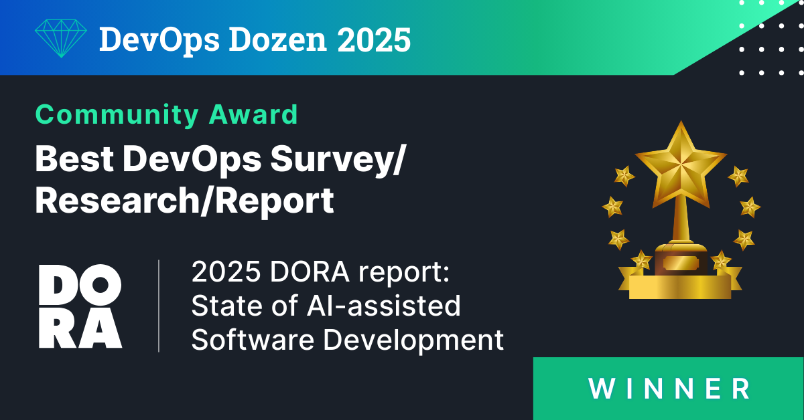
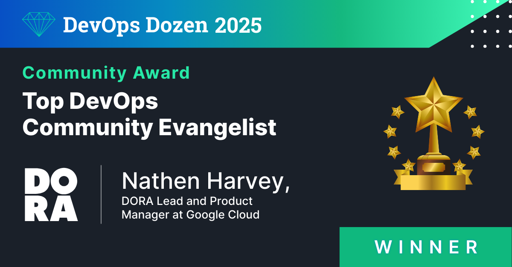

The [DevOps Dozen Awards](https://devopsdozen.com/) are an annual program organized by the [Techstrong Group](https://techstronggroup.com/). They honor the most influential individuals, innovative tools, and impactful companies within the DevOps community.

The awards are divided into two main tracks: [Community Awards](https://devopsdozen.com/devops-dozen-2026-community-award-winners/), focusing on people and leadership, and [Tools & Services Awards](https://devopsdozen.com/devops-dozen-2026-tools-and-services-award-winners/), focusing on technology and vendors. Winners are selected through a combination of public voting and a panel of expert judges.

## Congratulations to DORA!

The [State of AI-assisted Software Development](/research/2025/dora-report) won in the Best DevOps Survey/Analysis/Research category.

DORA's lead, [Nathen Harvey](https://www.linkedin.com/in/nathen), won in the Top DevOps Community Evangelist category.

## Congratulations to the DORA community!

Here are some of the other winners from across the [DORA community](https://dora.community/). Congratulations to all!

* **Best DevOps Book of the Year**: [Progressive Delivery](https://progressivedelivery.com/)
* **DevOps Industry Leader of the Year**: [Jyoti Bansal](https://www.linkedin.com/in/jyotibansal/) the CEO of [Harness](https://www.harness.io/?utm_source=dora&utm_medium=referral&utm_content=dora-report), a Gold Sponsor of the [2025 report](/research/2025/dora-report).
* **Best End-to-End DevOps Platform**: [Harness](https://www.harness.io/?utm_source=dora&utm_medium=referral&utm_content=dora-report), a Gold Sponsor of the [2025 report](/research/2025/dora-report).
* **Best Application of Generative AI in a DevOps Tool/Platform**: [Octopus Deploy's](https://octopus.com/?utm_source=DORA-google&utm_medium=referral&utm_campaign=global-082025-dora-report&utm_content=&utm_term=) Octopus AI Assistant. Octopus Deploy is a Gold Sponsor of the [2025 report](/research/2025/dora-report).
* **Best Platform Engineering Solution**: [Harness's](https://www.harness.io/?utm_source=dora&utm_medium=referral&utm_content=dora-report) Harness Internal Developer Portal (IDP). Harness is a Gold Sponsor of the [2025 report](/research/2025/dora-report).
