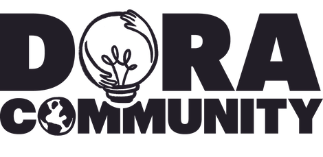
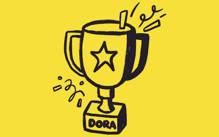

<small>This was originally [published](https://www.linkedin.com/pulse/dora-2025-year-review-doradotdev-bcfle) on [DORA's LinkedIn page](https://www.linkedin.com/company/doradotdev/).</small>

## DORA research

This year, we didn't just release one annual report; we released a trilogy. Each built on the last to tell the complete story of how AI is reshaping our industry—from the individual developer experience to the organizational bottom line.

{{< report_gallery
  img_1="/ai/gen-ai-report/dora-impact-of-generative-ai-in-software-development-report.png"
  url_1="/ai/gen-ai-report/report/"
  alt_1="Impact of Generative AI in Software Development"
  img_2="/research/shared/dora-report-2025/2025-state-of-ai-assisted-software-development-report.png"
  url_2="/research/2025/dora-report/"
  alt_2="State of AI-assisted Software Development"
  img_3="/ai/capabilities-model/report/2025-dora-ai-capabilities-model-report.png"
  url_3="/ai/capabilities-model/report/"
  alt_3="DORA AI Capabilities Model"
>}}

[Impact of Generative AI in Software Development](/ai/gen-ai-report/report/), released in March, built on our findings from 2024 and gave leaders and practitioners guidance and actionable insights to maximize AI's benefits while mitigating potential risks.

[State of AI-assisted Software Development](/research/2025/dora-report/), released in September, confirmed the amplifier effects of adopting AI throughout the software lifecycle. We found that AI improves throughput, but often at the cost of stability if your foundation isn't solid.

[DORA AI Capabilities Model](/ai/capabilities-model/report/), released in December, serves as a practical guide to the seven capabilities that amplify the benefits of AI. For each of the seven core capabilities, this report details implementation strategies, specific tactics for teams to get started, and methods for monitoring progress and fostering continuous improvement.

Beyond these three reports, we also published five additional research insights expanding our understanding of the human side of AI.

1. [AI is a tutor, not a cheater](/insights/ai-as-a-tutor/): Students are treating AI as a supplement to professors and TAs—a tireless "learning companion" that helps refine technical skills and clarify dense concepts.
1. [Rise of the "builder's mindset"](/insights/builder-mindset/): We proposed a new framework based on intent rather than job title. Whether you are in a Founder, Optimizer, Accelerator, or Learner mindset, your tools need to adapt to your goal.
1. [Four strategies to scale AI adoption](/insights/adopt-gen-ai/): We identified the four practical strategies that separate successful adoption from chaos.
1. [Measurement frameworks](/insights/measurement-frameworks/): Choose the framework that resonates with your organization. If it speaks to you and spurs your organization into action, it’s the right framework for right now.
1. [It’s not just about accuracy](/insights/concerns-beyond-accuracy-of-ai-output/): Our research uncovered that the real barriers to trust aren't just about wrong code: they are about deskilling, job displacement, and malicious use.

## DORA around the world

The world was watching! DORA’s work was featured in lots of industry coverage this year. It wasn’t just tech newsletters covering the report; it was household names. [CNN](https://edition.cnn.com/2025/09/23/tech/google-study-90-percent-tech-jobs-ai) and [Business Insider](https://www.businessinsider.com/google-study-software-engineering-changing-ai-2025-9) highlighted the sheer scale of adoption, bringing the reality of AI-assisted work to a general audience. Meanwhile, [Newsweek](https://www.newsweek.com/despite-using-ai-only-a-quarter-of-tech-workers-trust-it-10799089) focused on the tension between use and belief, noting that while usage is high, trust remains the critical hurdle. Seeing the [Financial Times](https://www.ft.com/content/24802151-1cd9-4a4b-b0b1-aa937a6a6606) cover our metrics confirmed something we’ve known for a long time: software delivery performance is now a board-level concern.

## DORA Community

The [DORA Community](https://dora.community/) had more than [100 discussion threads](https://groups.google.com/g/dora-community) and met for more than 20 community discussions. Our [YouTube channel](https://www.youtube.com/@dora-dev) now has more than 1,800 subscribers.

### Threads

The [DORA community discussion group](https://groups.google.com/g/dora-community) always has some passionate, insightful conversations. This year was no different, our community focused on metrics and the practical reality of what AI actually does to software delivery. Some highlights from this year’s conversations include:

* [Metrics in performance reviews](https://groups.google.com/g/dora-community/c/rsUw--izYhs/m/MYj0yHONEAAJ)
* [Measuring Lead Time and Identifying Bottlenecks](https://groups.google.com/g/dora-community/c/MfgzYQAu084/m/91ejLpacAQAJ)
* [Clarification Needed: Lead Time Starting Points](https://groups.google.com/g/dora-community/c/Pow9kRSILNY/m/E9ge3xNADAAJ)
* [Is it worth bothering with DevEx in pathological cultures?](https://groups.google.com/g/dora-community/c/Y0nCLIrr_XM/m/iGLVjMggAAAJ)
* [Transformational Leadership - How to get the skills](https://groups.google.com/g/dora-community/c/78o22DkFw70/m/JQLeFdwxAgAJ)

### Videos

Here are five video highlights from our 2025 community discussions.

* [State of AI-assisted Software Development](https://www.youtube.com/watch?v=Sz8NWaTiWfE&list=PLMtxeMdO4DaAyqLaGrm8q55COt8eCMrKl&index=6):  A breakdown of the 2025 report led by the report authors.
* [Code Reviews](https://www.youtube.com/watch?v=ZilOHXNJ7gU&list=PLMtxeMdO4DaAyqLaGrm8q55COt8eCMrKl&index=16): [Adrienne Braganza Tacke](https://www.linkedin.com/in/adriennetacke/) joined the community to share insights on improving code reviews.
* [Mobile & DORA (MORA)](https://www.youtube.com/watch?v=qyikCFaHLRk&list=PLMtxeMdO4DaAyqLaGrm8q55COt8eCMrKl&index=10): [Willy Rouvre](https://www.linkedin.com/in/wrouvre/) joined the community to discuss adapting of DORA’s software delivery metrics for mobile applications.
* [Have a heart: DORA & H.E.A.R.T](https://www.youtube.com/watch?v=SuNIhbDbUHA&list=PLMtxeMdO4DaAyqLaGrm8q55COt8eCMrKl&index=8): [Eric Maxwell](https://www.linkedin.com/in/eric-maxwell-30b2211/) shared a perspective on blending software delivery performance metrics and product success metrics using these two frameworks.
* [Spec-Driven Development with LLMs](https://www.youtube.com/watch?v=9Goq80lgxSY&list=PLMtxeMdO4DaAyqLaGrm8q55COt8eCMrKl&index=5): [Betsalel (Saul) Williamson](https://www.linkedin.com/in/betsalel/) demonstrated how to turn LLMs into reliable coding partners.

## Google Cloud DORA Awards

We can't wrap up the year without celebrating the people who do the work. The [DORA Awards ceremony](/awards/) was a highlight of the summer, recognizing the practitioners and teams who are pushing the boundaries of software delivery performance.

## Changes for DORA

This year, we officially ["de-acronymed" DORA](/brand-guidelines) to stand on its own and renamed our annual report from "Accelerate State of DevOps" to the “State of AI-assisted Software Development.” This change signals that our work expands beyond DevOps to include new technologies and ways of working. We have also officially evolved the four software delivery performance metrics into five metrics.

## Continuous delivery

In 2025, we shipped [267 changes](https://github.com/dora-team/dora.dev/pulls?q=is%3Apr+is%3Aclosed+merged%3A2025-01-01..2025-12-31) to [dora.dev](/)—averaging more than one deployment for every working day. From updating the research archive to refining the community platform, our open repository remained a hive of activity. This steady drumbeat of continuous delivery ensures our shared knowledge base stays current.

## Thank you!

You are what makes DORA possible! Our research requires your input, insights, and ideas. Thank you for contributing!

I would also like to recognize the [DORA research team](/research/team/), the [DORA community guides](https://dora.community/join), and my partners on the DORA advocacy team: [Amanda Lewis](https://www.linkedin.com/in/lewisamanda/) and [Dave Stanke](https://www.linkedin.com/in/davidstanke/).

## 2026 and beyond

DORA will continue to research and provide insights into the capabilities, conditions, practices, and metrics that help high-performing technology-driven teams thrive. We look forward to learning along with you throughout 2026 and beyond!

* Be part of the conversation at [https://dora.community](https://dora.community)
* Share your story: [Reply in this thread](https://groups.google.com/g/dora-community/c/_dS2C5TO8M4)—what was your biggest "aha!" moment in 2025?

Here’s to a 2026 full of _getting better at getting better_!

<small>This was originally [published](https://www.linkedin.com/pulse/dora-2025-year-review-doradotdev-bcfle) on [DORA's LinkedIn page](https://www.linkedin.com/company/doradotdev/).</small>
