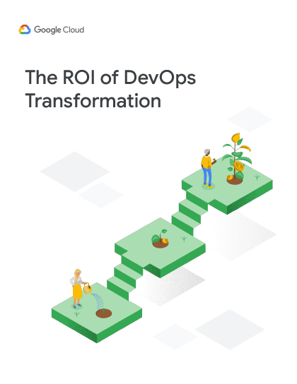

> Interested in being a sponsor of one of our upcoming Accelerate State of DevOps Reports?
>
> Please reach out to sponsor-dora@google.com for more information on the sponsorship opportunities!

## 2023 Accelerate State of DevOps Report

<section class="publicationHighlight">
    <aside>
        
    </aside>
    <article>
       
For the last nine years, we’ve produced the State of DevOps report, hearing from over 36,000 professionals worldwide.

        
We’ve outlined the DevOps practices that drive successful software delivery and operational performance, with a deep focus on user-centric design in the 2023 report.

        
Use these findings to accelerate organizational performance while reducing burnout.

       <a href="/research/2023/dora-report/" target="_blank"><button class="secondary">Download the report</button></a>
    </article>
</section>

## Prior State of DevOps Reports

- 
  **[2022 Accelerate State of DevOps Report](/research/2022/dora-report/)**
  [Download the report](/research/2022/dora-report/)

- 
  **[2021 Accelerate State of DevOps Report](/research/2021/dora-report/)**
  [Download the report](/research/2021/dora-report/)

- 
  **[2019 Accelerate State of DevOps Report](/research/2019/dora-report/2019-dora-accelerate-state-of-devops-report.pdf)**
  [Read PDF](/research/2019/dora-report/2019-dora-accelerate-state-of-devops-report.pdf)

- 
  **[2018 Accelerate State of DevOps Report](/research/2018/dora-report/2018-dora-accelerate-state-of-devops-report.pdf)**
  [Download the report](/research/2018/dora-report/)

- 
  **[2017 State of DevOps Report](/research/2017)**
  (in partnership with Puppet)
  [Download the report](/research/2017)

- 
  **[2016 State of DevOps Report](/research/2016/)**
  (in partnership with Puppet)
  [Download the report](/research/2016/)

- 
  **[2015 State of DevOps Report](/research/2015)**
  (in partnership with Puppet)
  [Download the report](/research/2015/)

- 
  **[2014 State of DevOps Report](/research/2014)**
  (in partnership with Puppet)
  [Download the report](/research/2014/)

## Additional Publications
<!-- add publications as list items, using markdown syntax (list items are designated with a leading dash) -->

- 
  **[The ROI of DevOps Transformation](/research/2020/)**
  [Download the Whitepaper](/research/2020/)
- 
  **[DevOps Awards Winners 2021](https://services.google.com/fh/files/misc/devops_awards_fullebook_final.pdf)**
  [Read the ebook](https://services.google.com/fh/files/misc/devops_awards_fullebook_final.pdf)