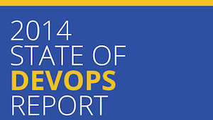

The 2014 State of DevOps Report provides compelling evidence that DevOps is not just a set of technical practices but a cultural shift that can drive significant improvements in IT and organizational performance. By adopting DevOps practices and fostering a culture of collaboration and continuous improvement, organizations can achieve higher levels of productivity, profitability, and market share.

Key findings of the report include:
* High-performing IT organizations were twice as likely to exceed their profitability, market share, and productivity goals.
* DevOps practices, such as [version control](/capabilities/version-control/) and [continuous delivery](/capabilities/continuous-delivery/), are correlated with high IT performance.
* [Organizational culture](/capabilities/generative-organizational-culture/] is a strong predictor of IT and organizational performance, with high-trust cultures leading to better results.
* [Job satisfaction](/capabilities/job-satisfaction/] is the number one predictor of organizational performance and is highly correlated with DevOps practices and culture.
* [Continuous integration](/capabilities/continuous-integration/) and [continuous delivery](/capabilities/continuous-delivery/), along with [automated testing](/capabilities/test-automation/) and [version control](/capabilities/version-control/), are key practices that impact IT performance.
* The longer an organization practices DevOps, the more its IT performance improves.
* A virtuous circle exists between IT performance and organizational performance, where each positively influences the other.

[Download the 2014 State of DevOps Report](2014-state-of-devops-report.pdf)