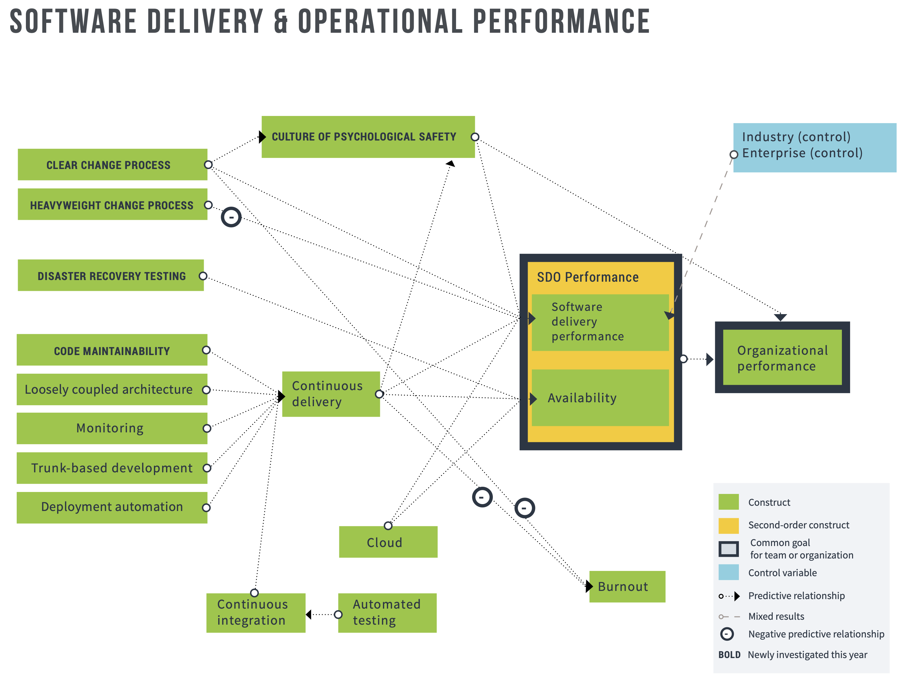

The DORA research program uses structural equation modeling (SEM), a predictive statistical modeling technique used to test relationships. We utilize PLS-PM (partial least squares path modeling) for our analysis, for several reasons: it does not require assumptions of normality in the data, it is will suited to exploratory and incremental research, and the analysis optimizes for prediction of the dependent variable (vs. testing for model fit of the data). All paths shown in the SEM figures are p < .05.

