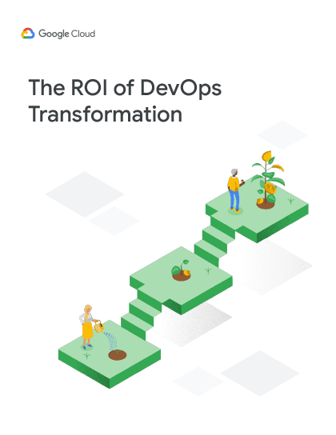

<grid class="border_none" style="margin-top:1rem;">
<item>

</item>

<item>

In 2020, DORA didn't write an Accelerate State of DevOps Report. We did, however, produce a whitepaper which explores the return on investment (ROI) that can be realized through a DevOps transformation project.

<a href="the-roi-of-devops-transformation-google-cloud-dora.pdf" target="_blank"><button class="secondary">Download the whitepaper</button></a>

</grid>

Technology transformations can yield substantial returns for organizations. The paper encourages a focus on value-driven approaches, reinvesting gains from efficiency improvements into innovation and value creation. It also highlights the positive impact on employee morale and organizational culture when teams spend less time on rework and more time on value-added development.

* Technology transformation can drive significant value and innovation for businesses, moving IT from a cost center to a value driver.
* Elite performers, who excel in software development speed and stability, reap the most benefits.
* The value includes not only cost savings but also the value gained from avoiding unnecessary rework and reinvesting in new features.
* Organizations should prioritize retaining and training existing talent, as it is more cost-effective and preserves institutional knowledge.
* The ability to experiment frequently is crucial for delivering valuable features to customers.
* Reducing downtime and change failure rates are key to minimizing costs and maximizing returns.
* Investing in a transformation can lead to substantial returns, making it a worthwhile strategic decision for businesses.

<a href="the-roi-of-devops-transformation-google-cloud-dora.pdf" target="_blank"><button class="secondary">Download the whitepaper</button></a>
