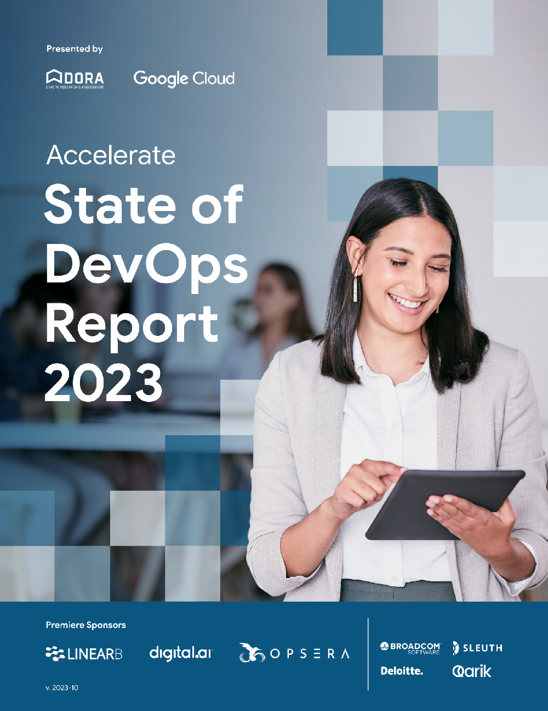

## Download the 2023 DORA Report

<grid class="border_none" style="margin-top:1rem;">
<item>

</item>
<item>

#### The 2023 DORA Report is available in the following languages:

<ul>
    <li style="font-size:1.25rem;"><a href="2023-dora-accelerate-state-of-devops-report.pdf" target="_blank">English</a></li>
    <li style="font-size:1.25rem;"><a href="2023-dora-accelerate-state-of-devops-report_es.pdf" target="_blank">Español</a></li>
    <li style="font-size:1.25rem;"><a href="2023-dora-accelerate-state-of-devops-report_es-419.pdf" target="_blank">Español - América Latina</a></li>
    <li style="font-size:1.25rem;"><a href="2023-dora-accelerate-state-of-devops-report_fr.pdf" target="_blank">Français</a></li>
    <li style="font-size:1.25rem;"><a href="2023-dora-accelerate-state-of-devops-report_it.pdf" target="_blank">Italiano</a></li>
    <li style="font-size:1.25rem;"><a href="2023-dora-accelerate-state-of-devops-report_pt-BR.pdf" target="_blank">Português - Brasil</a></li>
    <li style="font-size:1.25rem;"><a href="2023-dora-accelerate-state-of-devops-report_zh-TW.pdf" target="_blank">中文 – 简体</a></li>
    <li style="font-size:1.25rem;"><a href="2023-dora-accelerate-state-of-devops-report_ja.pdf" target="_blank">日本語</a></li>
    <li style="font-size:1.25rem;"><a href="2023-dora-accelerate-state-of-devops-report_ko.pdf" target="_blank">한국어</a></li>
</ul>

</item>
</grid>

A healthy culture is foundational, positively impacting technical capabilities, performance goals, and employee success. Teams prioritizing user needs tend to build the right things and build them right, demonstrating a balance of software delivery and operational performance.

The report emphasizes continuous improvement. Using metrics to understand strengths and weaknesses is a starting point. Teams should prioritize learning and adapting based on feedback rather than solely focusing on hitting performance targets.

Key findings include

* **Healthy culture is key**: [Generative organizational cultures](/capabilities/generative-organizational-culture/) correlate with 30% higher organizational performance.

* **User focus drives success**: Teams prioritizing user needs achieve 40% higher organizational performance and build both the right thing and build the thing right.

* **Technical capabilities matter**: [Continuous integration](/capabilities/continuous-integration/), [loosely coupled teams](/capabilities/loosely-coupled-teams/), and fast code reviews significantly improve software delivery and operational performance.

* **Documentation amplifies impact**: [High-quality documentation](/capabilities/documentation-quality/) drastically increases the effectiveness of technical capabilities on organizational performance.

* **Cloud flexibility is crucial**: Leveraging [flexible infrastructure](/capabilities/flexible-infrastructure/), often enabled by cloud, results in 30% higher organizational performance, while simply "lifting and shifting" can be detrimental.

* **Fair work distribution improves well-being**: Equitable work distribution reduces burnout but has no significant impact on those identifying as underrepresented. Underrepresented groups often take on more repetitive tasks, contributing to higher burnout levels.

* **Continuous improvement is essential**: Teams should adopt a mindset of continuous improvement, focusing on learning and adaptation rather than just achieving specific metric targets.
