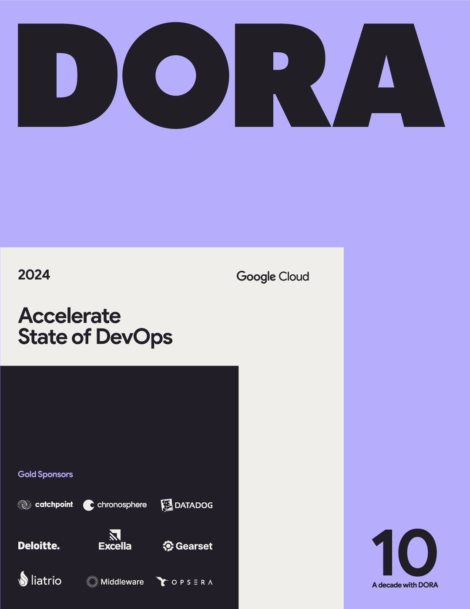
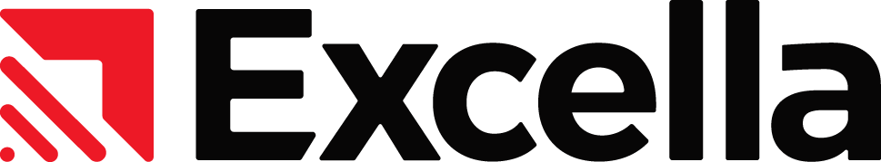
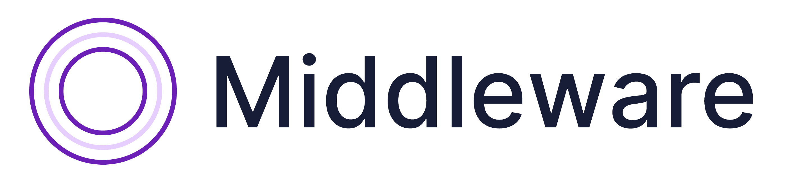
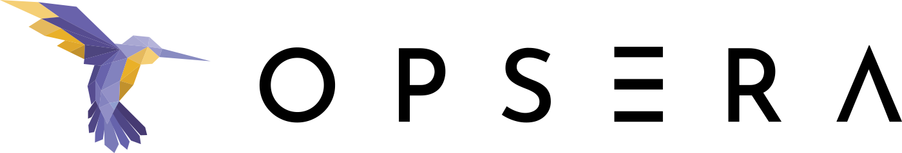

## Download the 2024 DORA Report

<grid class="border_none" style="margin-top:1rem;">
<item>

</item>
<item>
  <h4>The 2024 DORA Report is available in the following languages:</h4>
  <ul>
    <li style="font-size:1.25rem;"><a href="https://cloud.google.com/devops/state-of-devops/?hl=en&region=US" target="_blank">English</a></li>
    <li style="font-size:1.25rem;"><a href="https://cloud.google.com/devops/state-of-devops/?hl=es&region=ES" target="_blank">Español</a></li>
    <li style="font-size:1.25rem;"><a href="https://cloud.google.com/devops/state-of-devops/?hl=es-419&region=MX" target="_blank">Español - América Latina</a></li>
    <li style="font-size:1.25rem;"><a href="https://cloud.google.com/devops/state-of-devops/?hl=fr&region=FR" target="_blank">Français</a></li>
    <li style="font-size:1.25rem;"><a href="https://cloud.google.com/devops/state-of-devops/?hl=pt-br&region=BR" target="_blank">Português - Brasil</a></li>
    <li style="font-size:1.25rem;"><a href="https://cloud.google.com/devops/state-of-devops/?hl=zh-cn&region=CN" target="_blank">中文 – 简体</a></li>
    <li style="font-size:1.25rem;"><a href="https://cloud.google.com/devops/state-of-devops/?hl=zh-tw&region=TW" target="_blank">繁體中文</a></li>
    <li style="font-size:1.25rem;"><a href="https://cloud.google.com/devops/state-of-devops/?hl=ja&region=JP" target="_blank">日本語</a></li>
    <li style="font-size:1.25rem;"><a href="https://cloud.google.com/devops/state-of-devops/?hl=ko&region=KR" target="_blank">한국어</a></li>
  </ul>
</item>
</grid>

DORA has been investigating the capabilities, practices, and measures of high-performing technology-driven teams and organizations for over a decade. This is our tenth DORA report. We have heard from more than 39,000 professionals working at organizations of every size and across many different industries globally.

This report highlights the significant impact of AI on software development, explores platform engineering’s promises and challenges, and emphasizes user-centricity and stable priorities for organizational success.

### Gold Sponsors

The DORA report is published by Google Cloud with support from the following gold sponsors.

<grid class="border_none" style="margin-top:1rem;grid-template-columns: 1fr 1fr 1fr;">

<item style="display:flex; align-items:center;">

</item>

<item style="display:flex; align-items:center;">

</item>

<item style="display:flex; align-items:center;">

</item>

<item style="display:flex; align-items:center;">

</item>

<item style="display:flex; align-items:center;">

</item>

<item style="display:flex; align-items:center;">

</item>

<item style="display:flex; align-items:center;">

</item>

<item style="display:flex; align-items:center;">

</item>

<item style="display:flex; align-items:center;">

</item>

</grid>
