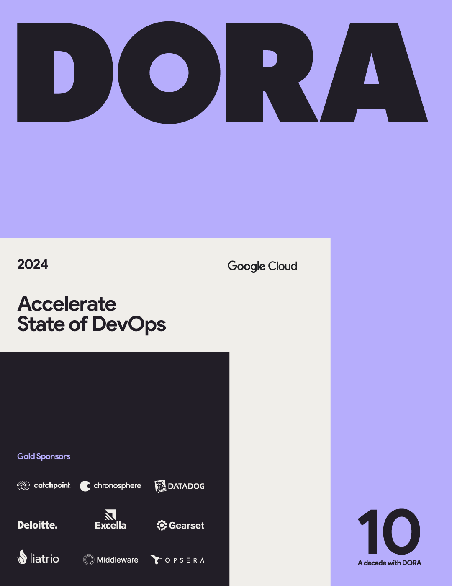
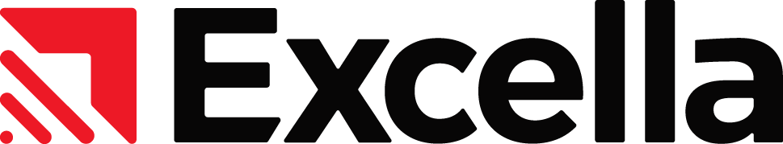
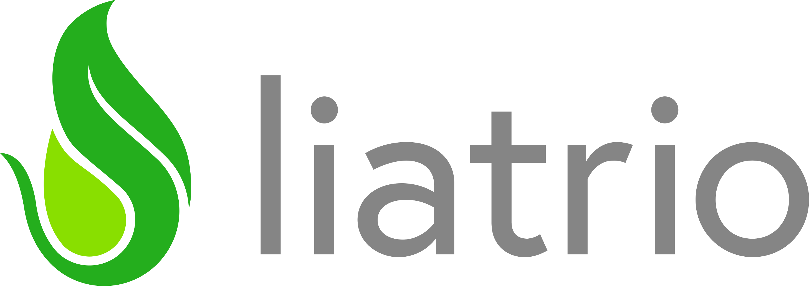
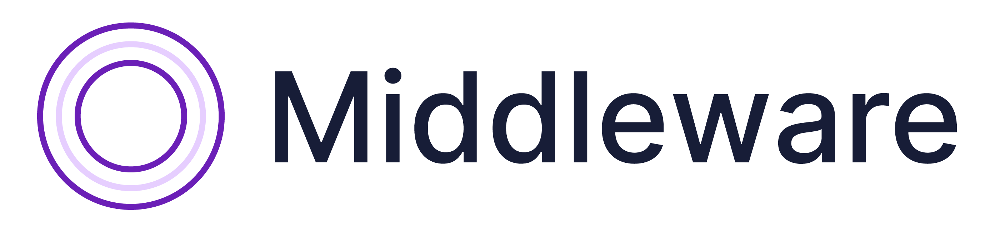

## Download the 2024 DORA Report

<grid class="border_none" style="margin-top:1rem;">
<item>

</item>
<item>

The 2024 DORA Report is available in the following languages:

<a href="2024-dora-accelerate-state-of-devops-report.pdf" target="_blank" class="button secondary">English</a>
<a href="2024-dora-accelerate-state-of-devops-report-es.pdf" target="_blank" class="button secondary">Español</a>
<a href="2024-dora-accelerate-state-of-devops-report-es-419.pdf" target="_blank" class="button secondary">Español - América Latina</a>
<a href="2024-dora-accelerate-state-of-devops-report-fr.pdf" target="_blank" class="button secondary">Français</a>
<a href="2024-dora-accelerate-state-of-devops-report-ptbr.pdf" target="_blank" class="button secondary">Português - Brasil</a>
<a href="2024-dora-accelerate-state-of-devops-report-zh-cn.pdf" target="_blank" class="button secondary">中文 – 简体</a>
<a href="2024-dora-accelerate-state-of-devops-report-zh-tw.pdf" target="_blank" class="button secondary">繁體中文</a>
<a href="2024-dora-accelerate-state-of-devops-report-ja.pdf" target="_blank" class="button secondary">日本語</a>
<a href="2024-dora-accelerate-state-of-devops-report-ko.pdf" target="_blank" class="button secondary">한국어</a>
</item>
</grid>

The 2024 report highlights that navigating today's rapidly shifting technological landscape requires balancing emerging tools with a steadfast focus on the human element of software development. While Artificial Intelligence is creating a paradigm shift in daily workflows, teams that prioritize end-user needs and operate under stable organizational priorities are the ones truly driving product quality and organizational success.

Taking an experimental approach to continuous improvement remains essential for modern teams. Organizations are encouraged to assess their current baseline, formulate hypotheses, and measure the impact of changes iteratively. Embracing transformational leadership and fostering an environment of continuous learning are critical to navigating the growing pains associated with new technologies and platforms.

**Key findings include:**

*   **AI brings clear benefits but unexpected tradeoffs:** AI adoption significantly increases individual productivity, flow, and job satisfaction. However, it also negatively impacts [software delivery stability and throughput](/guides/dora-metrics/), reminding teams that fundamentals like [small batch sizes](/capabilities/working-in-small-batches/) and [robust testing](/capabilities/test-automation/) remain crucial.
*   **User-centricity is the ultimate driver of performance:** Organizations that prioritize the end-user experience build higher-quality products. Developers working with a [user-centric mindset](/capabilities/user-centric-focus/) are more productive, more satisfied, and less likely to experience burnout.
*   **Stable priorities are critical for well-being:** Unstable organizational priorities cause meaningful decreases in productivity and substantial increases in burnout. This negative impact is highly resistant to mitigation and persists even in environments with strong leaders and high-quality documentation.
*   **Platform engineering boosts productivity, but monitor stability:** Utilizing an [internal developer platform](/capabilities/platform-engineering/) improves individual productivity, team performance, and overall organizational performance. However, it can also lead to decreased change stability and throughput, requiring careful implementation focused on developer independence.
*   **Transformational leadership matters:** [Leaders who inspire, intellectually stimulate, and support their teams](/capabilities/transformational-leadership/) significantly improve employee productivity, organizational performance, and job satisfaction while simultaneously decreasing burnout.
*   **Infrastructure flexibility remains essential:** Leveraging [flexible cloud infrastructure](/capabilities/flexible-infrastructure/) directly increases organizational performance. Conversely, simply migrating to the cloud without adopting its inherent flexibility can be more harmful than staying in a traditional data center.

### Gold Sponsors

The DORA report is published by Google Cloud with support from the following gold sponsors.

<grid class="border_none" style="margin-top:1rem;grid-template-columns: 1fr 1fr 1fr;">

<item style="display:flex; align-items:center;">

</item>

<item style="display:flex; align-items:center;">

</item>

<item style="display:flex; align-items:center;">

</item>

<item style="display:flex; align-items:center;">

</item>

<item style="display:flex; align-items:center;">

</item>

<item style="display:flex; align-items:center;">

</item>

<item style="display:flex; align-items:center;">

</item>

<item style="display:flex; align-items:center;">

</item>

<item style="display:flex; align-items:center;">

</item>

</grid>
