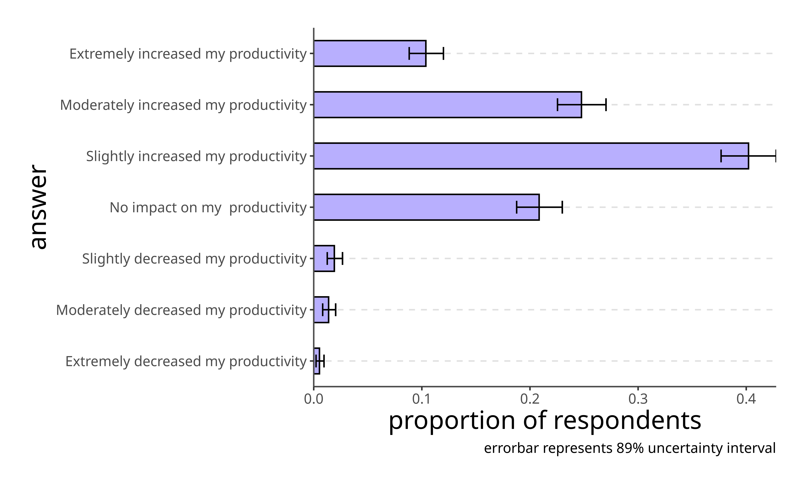

## Fostering developers' trust in generative artificial intelligence

It's no secret that generative artificial intelligence (GenAI) is rapidly changing the landscape of software development, with discussions about best practices for applying this transformative technology dominating the popular press. Perhaps nowhere on Earth have these discussions been more frequent and passionate than inside the organizations dedicated to making GenAI accessible and useful to developers, including at Google. During one such discussion between researchers on our [DORA](/research/team) and Engineering Productivity Research (EPR) teams, we were struck by a recurring finding common to development professionals both inside and outside of Google:

**Using GenAI makes developers feel more productive, and developers who trust GenAI use it more.**

On the surface, this finding may seem somewhat... obvious. But, for us, it highlighted the deep need to better understand the factors that impact developers' trust in GenAI systems and ways to foster that trust, so that developers and development firms can yield the most benefit from their investment in GenAI development tools.

Here, we reflect on findings from several studies conducted at Google, regarding the productivity gains of GenAI use in development, the impacts of developers' trust on GenAI use, and the factors we've observed which positively impact developers' trust in GenAI. We conclude with five suggested strategies that organizations engaged in software development might employ to foster their developers' trust in GenAI, thereby increasing their GenAI use and maximizing GenAI-related productivity gains.

### Trust and productivity

Research conducted by Google and other respected voices in technology research has found consistently high use of GenAI by software developers, and developers hold largely favorable views of using GenAI tools at work. Our research suggests that this warm reception of GenAI amongst professional developers is due, in no small part, to significant increases in reported productivity from using GenAI.

The DORA team found that, outside of Google, 75% of 2024 DORA survey respondents reported positive impacts of GenAI on their productivity. Internal to Google, the EPR team found a similar number of developers reported a positive impact of GenAI on their productivity, as well.

Importantly, developers who trust GenAI more reap more positive productivity benefits from its use. In a logs-based exploration of Google developers' trust in AI code completion, our EPR team found that developers who frequently accepted suggestions from a GenAI-assisted coding tool submitted more change lists (CLs) and spent less time seeking information than developers who infrequently accepted suggestions from the same tool. This was true even when controlling for confounding factors, including job level, tenure, development type, programming language, and CL count. Put simply, **developers who trust GenAI more are more productive**.

Unfortunately, developers' trust in GenAI is relatively low. According to [StackOverflow's 2024 Developer Survey](https://survey.stackoverflow.co/2024/ai#developer-tools), trusting the output of GenAI is presently developers' number one challenge with AI at work, and Google's research supports this finding. The DORA team found 39% of developers outside of Google trust the quality of GenAI output only "a little" or "not at all," and these numbers are similar amongst developers at Google.

We find these low levels of trust concerning, because they suggest that a subset of developers may not be experiencing the productivity gains they could from GenAI.

### Five strategies for fostering developers' trust in genai

Given the significant investment many organizations are making in GenAI, and the likelihood that increasing developers' trust in GenAI would improve returns on those investments, we believe it is important to reflect on our prior research and offer the following five strategies organizations might take to foster developers' trust in GenAI:

1. **Establish a policy about acceptable GenAI use, even if your developers are good corporate citizens.** Policies about the tasks, purposes, and data that developers can and cannot use in conjunction with GenAI tools are often viewed through the lens of preventing "bad" behavior, in the form of proprietary data leaks, security breaches, and poor stewardship of user data. While important, preventing irresponsible use of GenAI is only half of the story. Our data suggest establishing clear guidelines encouraging acceptable use of GenAI will likely also promote cautious and responsible developers to use GenAI, by assuaging fears of unknowingly acting irresponsibly. In our survey, the DORA team found that employees who felt their organizations were more transparent about the use of GenAI trusted GenAI more. Unfortunately, in qualitative interviews, most participants were unable to say with certainty whether their organization had any policy about the use of GenAI in development, at all. Together, these findings suggest that many firms could increase their employees' trust in GenAI by providing more explicit direction about its use and sufficiently advertising that policy to their workforce. Google has previously published guidance on [how to craft an acceptable use policy for GenAI](https://cloud.google.com/transform/how-to-craft-an-acceptable-use-policy-for-gen-ai-and-look-smart-doing-it), including recommendations for specifying scope, enforcement responsibilities, and delegating accountability for data governance and information security. Our research suggests that comprehensive acceptable use policies which include these elements can help developers feel empowered to rely on and use GenAI, by knowing that appropriate risk-mitigating guardrails are in place. But, we believe that even a lightweight policy, such as a guide to aligning GenAI-produced code to the company's programming conventions, is likely a better signal that GenAI use is sanctioned than a simple lack of explicit prohibitions. For some firms, it may even be beneficial to externalize company policies about GenAI use, to assure end users of their products that development was handled responsibly and [using reliable sources](https://cloud.google.com/gemini/docs/discover/works#how-when-gemini-cites-sources).

1. **Double-down on fast high-quality feedback, like code reviews and automated testing, using GenAI as appropriate**. Developers' perceptions that their organization's code review and automated testing processes are rigorous appear to foster trust in GenAI. This is likely because appropriate safeguards assuring them that any errors that may be introduced by GenAI-generated code will be detected before it is deployed to production. Interestingly, data from the DORA team suggests that the adoption of GenAI makes code reviews faster and improves reported code quality, likely by allowing a wider breadth of code to be analyzed at a faster pace than could reasonably be expected of a human. So, it is possible there is a virtuous cycle in which applying appropriate safeguards fosters trust in GenAI and encourages its use in feedback processes, like code reviews and testing. This strengthens the robustness of the safeguards which foster trust, further promoting its use. The logical entry point for this cycle is likely encouraging developers to use GenAI in tasks that feel low-risk, until their trust is built and reinforced over time.

1. **Provide opportunities for developers to gain exposure with GenAI, especially those which support using their preferred programming language**. Trust in GenAI increases as developers gain exposure to it and grow more familiar with its uses, strengths, and limitations. Additionally, developers appear to trust GenAI more when engaging it for tasks in their preferred programming language, likely because they have more expertise to assess and correct its outputs. Providing opportunities to gain exposure to GenAI, like training, unstructured activities, or slack time devoted to trying GenAI, will help increase trust, _especially if such activities can be performed in developers' preferred programming language_ in which they are best equipped to evaluate GenAI's quality.

1. **Encourage GenAI use, but don't force it**. Leadership actively encouraging the use of GenAI in development work appears to be effective in promoting its use amongst individual contributor developers. At the same time, control over the degree to which GenAI intervenes and the tasks in which it is employed increases developers' overall trust in GenAI tools. So, while it is likely to the benefit of the organization for people in leadership roles to encourage their ICs to test, evaluate, and employ GenAI in their daily work, it is important developers do not feel obligated to use GenAI. One approach to encouraging GenAI use in a manner that prioritizes developers' sense of control is to promote the spread of knowledge organically, by [building community structures](/guides/devops-culture-transform/#build-community-structures-to-spread-knowledge) to foster conversations about GenAI.

1. **Help developers think beyond automating their day-to-day work and envision what the future of their role might look like**. Fears that GenAI might lead to a future loss of employment for development professionals have been well-publicized and were a recurring theme in our interviews and survey data. We believe much of this fear stems from the fact that the most common uses of GenAI in development replicate the daily work of developers, like writing code or test cases. Delegating these tasks to GenAI has, indeed, made developers more productive. However, without a clear vision for what the transformed role of a developer working at a higher level of abstraction in which these repetitive tasks are delegated to GenAI resembles, it will be hard to assuage fears of unemployment. That is, delegating mundane tasks, such as generating test paths, creating documentation, and providing system health monitoring, is a clear small step toward using GenAI effectively. But, long-term, developers will likely need guidance about how to reallocate the time saved, and encouragement to explore new ways to improve user experience, innovate with emerging technologies, and add value for their companies and users. We are unable to predict what development work will look like in the future, or what new tasks will be performed as a result of GenAI increasing developer capacity. But, we believe that acknowledging GenAI will fundamentally change development work, and empowering developers to have a voice in shaping the future of their profession will foster trust in GenAI by helping developers co-create and move toward a world where GenAI _transforms_ their work, rather than simply _replicating_ it.

### Conclusion

We are still at a moment in which the ubiquitous use of GenAI in development is nascent, and the long-term efficacy of the strategies proposed above remains to be determined. Yet, given our opportunity to see emerging AI-powered development tools in action at Google and across the industry, we wanted to share our insights and observations to help organizations navigate these still-uncertain waters by sharing insights from our early inquiries. While the long-term future of GenAI use across the software development lifecycle is inevitable, the near-term path to successfully realizing that future is less clear.  We believe those individuals and organizations that embrace this change, start with small projects, learn, and iterate will be in a better position to proactively navigate it than those that sit on the sidelines.  The good news is that you are not alone in this journey, and we look forward to continuing to co-create the future of software development with you.