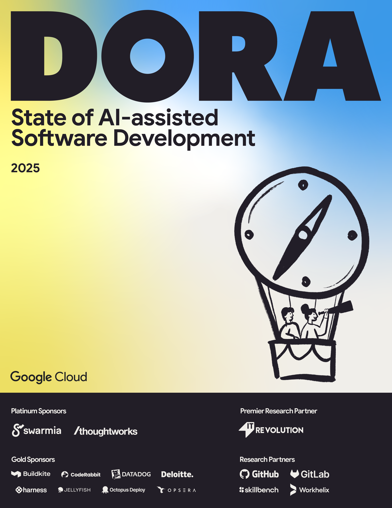

## Download the 2025 DORA Report

<grid class="border_none mt-1">
<item>

</item>
<item>

    The State of AI-assisted Software Development report reveals AI’s primary role is as an amplifier, magnifying an organization’s existing strengths and weaknesses. The greatest returns on AI investment come not from the tools themselves, but from a strategic focus on the underlying organizational system.

    This year’s research introduces the new DORA AI Capabilities Model, which identifies the key technical and cultural practices that are proven to amplify the positive impacts of AI on performance.

<a href="https://cloud.google.com/dora" target="_blank" class="button secondary">Get the report</a>

</item>
</grid>

### Research Partners

The 2025 DORA Report is presented by Google Cloud in collaboration with the following research partners.

#### Premier Research Partner

<grid class="border_none mt-1 grid-single">

<item class="sponsor-item">

IT Revolution empowers enterprise technology leaders with essential insights for succeeding in the digital age through books, papers, events, and more. We focus on leadership strategies and organizational practices that drive high performance in large, complex companies, helping them thrive in the rapidly evolving business landscape.

</item>

</grid>

#### Research Partners

<grid class="border_none mt-1">

<item class="sponsor-item">

GitHub is the world’s leading AI-powered developer platform to build, scale, and deliver secure software. Over 150 million people, including more than 90% of the Fortune 100 companies, use GitHub to collaborate and experiment across 420+ million repositories.

</item>

<item class="sponsor-item">

GitLab is the most comprehensive, intelligent DevSecOps platform for software innovation. GitLab enables organizations to increase developer productivity, improve operational efficiency, reduce security and compliance risk, and accelerate digital transformation. More than 50 million registered users and more than 50% of the Fortune 100 trust GitLab to ship better, more secure software faster.

</item>

<item class="sponsor-item">

SkillBench helps organizations implement generative AI to boost productivity and skills. Our AI-native platform decomposes focal work, certifies outputs with internal experts, predicts skill-based outcomes of AI use, and securely traces turn-by-turn developer-AI interactions for validation. This new telemetry unlocks strategic possibilities for organizations and their people.

</item>

<item class="sponsor-item">

Workhelix helps large enterprises plan, co-create, measure, and accelerate AI transformation. We identify where generative AI drives the greatest ROI, co-create actionable rollout plans, and track adoption over time--turning investments into measurable gains. Founded by Stanford and MIT experts, we blend causal-inference analytics with change-management tools for every adoption phase.

</item>

</grid>
