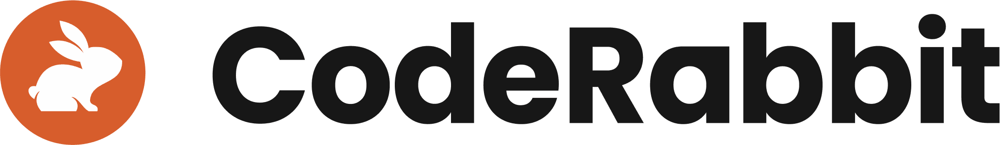

## Sponsors

The 2025 DORA Report was supported by the following sponsors.

### Platinum Sponsors

<grid class="border_none mt-1 grid-single">

<item class="sponsor-item">

Swarmia is a software engineering intelligence platform that helps companies ship better software faster. By combining research-backed metrics — including DORA and SPACE — with developer experience surveys and automated feedback loops, Swarmia gives every level of the engineering organization the insights and tools they need to drive continuous improvement. From high-level visibility for engineering leaders to real-time code review notifications for software engineers, the platform helps everyone in the engineering organization quickly identify and fix the bottlenecks that are slowing them down. Swarmia is trusted by world-class companies of all sizes, including Lovable, Superhuman, Miro, Webflow, and several Fortune 500s.

</item>

<item class="sponsor-item">

Thoughtworks is a global technology consultancy that integrates design, engineering and AI to drive digital innovation. We are over 10,000 people strong across 48 offices in 19 countries. For 30 years, we’ve delivered extraordinary impact together with our clients by helping them solve complex business problems with technology as the differentiator.

</item>

</grid>

### Gold Sponsors

<grid class="border_none mt-1">

<item class="sponsor-item">

Buildkite is the software delivery platform built for the AI era. We enable engineering teams to ship faster and tighten feedback loops with AI-enabled pipelines, unlimited scale, and complete control over their delivery environment.

</item>

<item class="sponsor-item">

CodeRabbit is the industry's leading AI Code Review platform helping software developers merge PRs 50% faster with 50% fewer bugs than manual reviews. CodeRabbit's purpose-built context engineering approach works with foundational LLMs to automate code reviews, catch more bugs, and free up developers from lengthy review cycles.

</item>

<item class="sponsor-item">

Datadog is the observability and security platform for cloud applications. Our SaaS platform integrates and automates infrastructure monitoring, application performance monitoring, log management, real-user monitoring, and many other capabilities to provide unified, real-time observability and security for our customers’ entire technology stack.

</item>

<item class="sponsor-item">

Transform the heart of your business across products, platforms and operations. Organizations are facing new challenges and evolving technological disruptions. To drive progress, harness the power of Deloitte’s AI & Engineering services to help drive product and service enhancements, achieve efficiencies, improve financial performance, and accelerate speed to market.

</item>

<item class="sponsor-item">

Harness is the AI DevOps platform for complete software delivery, providing a simple, safe, and secure way for customers like United Airlines and Citibank to release applications into production. Based in San Francisco and backed by top investors, Harness uses AI to reduce manual toil, save time, and mitigate risk.

</item>

<item class="sponsor-item">

Jellyfish is the leading Software Engineering Intelligence Platform, helping 500+ companies including DraftKings, Keller Williams and Blue Yonder, leverage AI to transform how they build software. By turning fragmented data into context-rich guidance, Jellyfish enables better decisions across planning, developer experience and delivery so R&D teams can deliver stronger business outcomes.

</item>

<item class="sponsor-item">

Octopus Deploy sets the standard for Continuous Delivery (CD), empowering software teams to deliver value in an agile way. Globally, over 4,000 organizations rely on Octopus to efficiently orchestrate software delivery across multi-cloud, Kubernetes, data centers, and hybrid environments, whether containerized modern apps or heritage applications.

</item>

<item class="sponsor-item">

Opsera is an AI-powered DevOps platform for any apps and teams. Automated pipelines, integrations, and actionable analytics help organizations release faster, improve software quality, and boost efficiency. Leading companies rely on Opsera to build, deploy, secure, and help improve overall developer productivity and experience, all from a unified, no-code platform.

</item>

</grid>

### Silver Sponsors

<grid class="border_none mt-1 grid-triple">

<item class="sponsor-item">

</item>

<item class="sponsor-item">

</item>

<item class="sponsor-item">

</item>

<item class="sponsor-item">

</item>

<item class="sponsor-item">

</item>

<item class="sponsor-item">

</item>

<item><!-- empty <item> for spacing --></item>

<item class="sponsor-item">

</item>

</grid>
