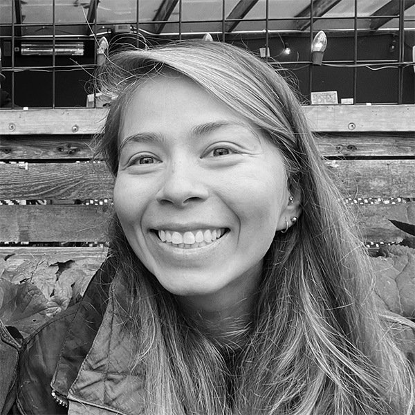
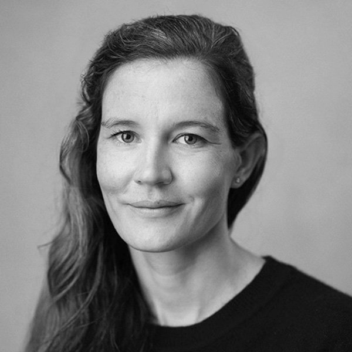

# Meet DORA’s Research Team

### Derek DeBellis

Derek is a quantitative user experience researcher at Google and the lead investigator for DORA.
Derek focuses on survey research, logs analysis, and figuring out ways to measure concepts that
demonstrate a product or feature is delivering capital-v value to people. Derek has published on
human-AI interaction, the impact of COVID-19's onset on smoking cessation, designing for NLP
errors, the role of UX in privacy discussions, team culture, and AI’s relationship to employee
well-being and productivity. His current extracurricular research is exploring ways to simulate
the propagation of beliefs and power.

### Dr. Kevin M. Storer

Dr. Kevin M. Storer is a qualitative researcher at Google, where he leads ethnographic research for
the DORA team. Kevin has been conducting human-centered studies of software developers since 2015,
spanning diverse problem contexts, participant profiles, and research methods. Kevin’s research has
been published in top scientific venues on the topics of artificial intelligence, ubiquitous
computing, and interaction design.

### Daniella Villalba, PhD

Daniella Villalba is a user experience researcher at Google. She uses survey research to understand
the factors that make developers happy and productive. Before Google, Daniella studied the benefits
of meditation training, and the psycho-social factors that affect the experiences of college
students. She received her PhD in Experimental Psychology from Florida International University.)

### Michelle Irvine

Michelle Irvine is a technical writer at Google, and her research focuses on documentation and
other technical communication. Before Google, she worked in educational publishing and as a
technical writer for physics simulation software. Michelle has a BSc in Physics, and an MA in
Rhetoric and Communication Design.

### Kim Castillo

Kim Castillo is a user experience program manager at Google. Kim leads the cross-functional effort
behind DORA, overseeing its research operations and the publication of this report since 2022. Kim
also works on UX research for Gemini in Google Cloud. Prior to Google, Kim enjoyed a career in tech
and working in technical program management and agile coaching. Kim's roots are in psycho-social
research focused on topics of extrajudicial killings, urban poor development, and community
resilience in her country of origin, the Philippines.

## Meet the DORA Collective
The collective includes current and former leaders, researchers, authors, and subject matter experts who have all made significant contributions to the research program.

  - Amanda Lewis
  - Benjamin Good
  - Brenna Washington
  - Claire Peters
  - Dave Farley
  - Dave Stanke
  - Dustin Smith
  - Eric Maxwell
  - Frank Xu
  - Gene Kim
  - James Brookbank
  - Jeffrey P. Winer, PhD
  - Jessie Frazelle
  - Jez Humble
  - John Speed Mayers
  - Lolly Chessie
  - Nathen Harvey
  - Nicole Forsgren, PhD
  - Steve McGhee
  - Todd Kulesza

Prior to 2018, The State of DevOps Report was published [in partnership with Puppet](https://www.puppet.com/resources/history-of-devops-reports).
