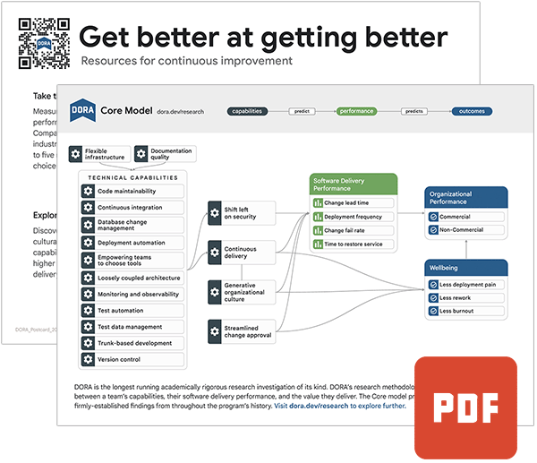

## Tools

<section>
    <article>
    
    <aside>
    <h4>The Four Keys: Instrument your Software Delivery Performance</h4>
    
The Four Keys is an open source project which provides a bootstrapper to create a metrics aggregator and dashboard for the four key DORA software delivery metrics (Deployment Frequency, Lead Time for Changes, Time to Restore Services, Change Failure Rate). Visit <a href="https://bit.ly/dora-fourkeys" target="_blank">https://bit.ly/dora-fourkeys </a>to learn how to install it and connect it to data sources including your version control and CI/CD systems.

    </aside>
    </article>
</section>

-----

## Books

<section>
    <article>
    
    <aside>
    <h4> Accelerate, The Science of Lean Software and DevOps: Building and Scaling High Performing Technology Organizations </h4>
    
How can we apply technology to drive business value? For years, we've been told that the performance of software delivery teams doesn't matter―that it can't provide a competitive advantage to our companies. Through four years of groundbreaking research to include data collected from the State of DevOps reports conducted with Puppet, Dr. Nicole Forsgren, Jez Humble, and Gene Kim set out to find a way to measure software delivery performance―and what drives it―using rigorous statistical methods. This book presents both the findings and the science behind that research, making the information accessible for readers to apply in their own organizations. Readers will discover how to measure the performance of their teams, and what capabilities they should invest in to drive higher performance. This book is ideal for management at every level.

    </aside>
    </article>
</section>

[Accelerate by Nicole Forsgren Ph.D, Jez Humble, and Gene Kim](https://www.google.com/books/edition/_/Kax-DwAAQBAJ?hl=en)

<section>
    <article>
    
    <aside>
    <h4> Google Cloud's Enterprise DevOps Guidebook  </h4>
    
Learn from Google Cloud DevOps professionals on our best practices for implementing DORA principles during your DevOps transformation. The goal of this chapter is to inform customers how to use DORA’s resources to measure their own performance and start their first team experiment. <a href="https://cloud.google.com/resources/dora-enterprise-guidebook" target="_blank">DevOps Guidebook</a>

    </aside>
    </article>
</section>

-----
## Graphics

<grid class="border_none">
    <item>
        <h3>Postcard (5x7)</h3>
        <content>
        
        

            Print this postcard (native size: 5" high by 7" wide) and use it to share DORA with your colleagues and communities.
             
            <a href="img/DORA_Postcard_2023-10.pdf" target="_blank">DORA Postcard</a>
        

        </content>
    </item>
    <item>
        <h3 id="graphics">2023 State of DevOps Infographic</h3>
        <content>
        
        

            This infographic summarizes key findings from DORA's 2023 Accelerate State of DevOps Report.
             
            <a href="img/2023-DORA-Report-Infographic.v10.pdf" target="_blank">Infographic</a>
        

        </content>
    </item>
</grid>