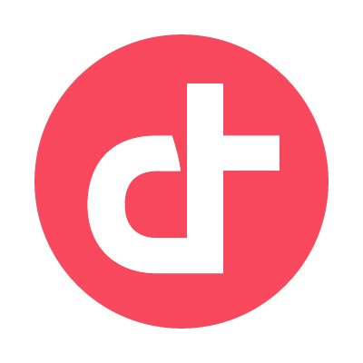
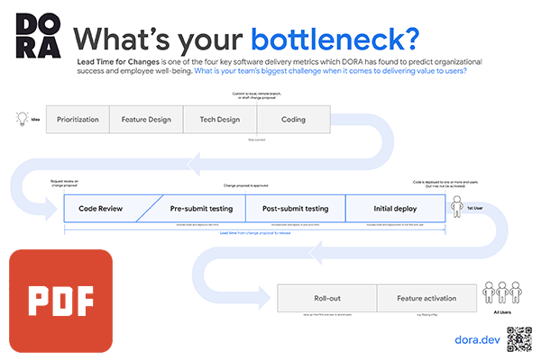

## Source-available tools

Each of these tools will help your team collect and visualize <a href="/guides/dora-metrics-four-keys/">DORA’s software delivery metrics: the four keys</a>. The source code for each is available free of charge.

<section>
    <article>
    
    <aside>
    <h4 class="source-available-project"><a href="https://devlake.apache.org/" target="_blank">Apache DevLake&#8482;</a> <a class="google-material-icons" href="https://devlake.apache.org/" target="_blank" aria-label="Apache DevLake&#8482;'s website">open_in_new</a></h4>
    
Apache DevLake™ (Incubating) ingests, analyzes, and visualizes the fragmented data from DevOps tools to distill insights for engineering excellence. Debug engineering processes and discover opportunities with DORA, Community Growth, Engineering Throughput and more DevLake dashboards. <a class="google-material-icons source-available-repo" href="https://github.com/apache/incubator-devlake" target="_blank" aria-label="Apache DevLake&#8482;'s source code">github</a>

    </aside>
    </article>
</section>

-----

<section>
    <article>
    
    <aside>
    <h4 class="source-available-project"><a href="https://github.com/liatrio/backstage-dora-plugin" target="_blank">Liatrio backstage-dora-plugin</a> <a class="google-material-icons" href="https://github.com/liatrio/backstage-dora-plugin" target="_blank" aria-label="Liatrio backstage-dora-plugin's code repository">open_in_new</a></h4>
    
This is a plugin for the <a href="https://backstage.io/" target="_blank">Backstage project</a> that provides a seamless way to display <a href="/guides/dora-metrics-four-keys/">DORA Metrics</a> in your developer portals. <a class="google-material-icons source-available-repo" href="https://github.com/liatrio/backstage-dora-plugin"" target="_blank" aria-label="Liatrio backstage-dora-plugin's code repository">github</a>

    </aside>
    </article>
</section>

-----

<section>
    <article>
    
    <aside>
    <h4 class="source-available-project"><a href="https://github.com/middlewarehq/middleware" target="_blank">Middleware</a> <a class="google-material-icons" href="https://github.com/middlewarehq/middleware" target="_blank" aria-label="Middleware's code repository">open_in_new</a></h4>
    
Middleware is an open-source tool designed to help engineering leaders measure and analyze the effectiveness of their teams using the DORA  metrics. The DORA metrics are a set of <a href="/guides/dora-metrics-four-keys/">four key values</a> that provide insights into software delivery performance and operational efficiency. <a class="google-material-icons source-available-repo" href="https://github.com/middlewarehq/middleware" target="_blank" aria-label="Middleware's source code">github</a>

    </aside>
    </article>
</section>

-----

<section>
    <article>
    
    <aside>
    <h4 class="source-available-project"><a href="https://github.com/DevoteamNL/opendora" target="_blank">OpenDORA</a> <a class="google-material-icons" href="https://github.com/DevoteamNL/opendora"" target="_blank" aria-label="OpenDORA's code repository">open_in_new</a></h4>
    
OpenDORA includes an open-source plugin for <a href="https://backstage.io/" target="_blank">Backstage</a>, a popular developer portal platform. It integrates with <a href="https://devlake.apache.org/" target="_blank">Apache DevLake</a> to organize and aggregate data from deployment and project management tooling like Gitlab, GitHub, Jira, and Jenkins. OpenDORA extracts meaningful insights from this data through its API, and renders dashboards within Backstage that provide insights on the teams' performance. <a class="google-material-icons source-available-repo" href="https://github.com/DevoteamNL/opendora" target="_blank" aria-label="OpenDORA's source code">github</a>

    </aside>
    </article>
</section>

-----

## Books

<section>
    <article>
    
    <aside>
    <h4> Accelerate, The Science of Lean Software and DevOps: Building and Scaling High Performing Technology Organizations </h4>
    
How can we apply technology to drive business value? For years, we've been told that the performance of software delivery teams doesn't matter―that it can't provide a competitive advantage to our companies. Through four years of groundbreaking research to include data collected from the State of DevOps reports conducted with Puppet, Dr. Nicole Forsgren, Jez Humble, and Gene Kim set out to find a way to measure software delivery performance―and what drives it―using rigorous statistical methods. This book presents both the findings and the science behind that research, making the information accessible for readers to apply in their own organizations. Readers will discover how to measure the performance of their teams, and what capabilities they should invest in to drive higher performance. This book is ideal for management at every level.

    </aside>
    </article>
</section>

[Accelerate by Nicole Forsgren Ph.D, Jez Humble, and Gene Kim](https://www.google.com/books/edition/_/Kax-DwAAQBAJ?hl=en)

<section>
    <article>
    
    <aside>
    <h4> Google Cloud's Enterprise DevOps Guidebook  </h4>
    
Learn from Google Cloud DevOps professionals on our best practices for implementing DORA principles during your DevOps transformation. The goal of this chapter is to inform customers how to use DORA’s resources to measure their own performance and start their first team experiment. <a href="https://cloud.google.com/resources/dora-enterprise-guidebook" target="_blank">DevOps Guidebook</a>

    </aside>
    </article>
</section>

-----
## Graphics

<grid class="border_none">
    <item>
        <h3>Commit-to-prod</h3>
        <content>
        
        

            This graphic illustrates the journey that a change takes from inception to delivery. Use it to facilitate conversations and <a href="/guides/value-stream-management/">value stream mapping</a> exercises.
             
            <a href="img/dora-commit-to-prod.pdf" target="_blank">Commit-to-prod</a>
        

        </content>
    </item>
</grid>

-----
## Websites

<grid class="border_none">
    <item>
        <h3>conversations.dora.dev</h3>
        <content>
        
        

            Want better team performance and well-being? Start a conversation to understand where you are today, and discover opportunities for improvement. Use these questions to kick off a discussion and see where it takes you.
             
            <a href="https://conversations.dora.dev/" target="_blank">conversations</a>
        

        </content>
    </item>
</grid>