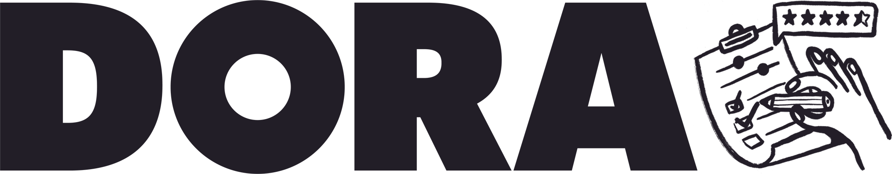

# The DORA survey is open now

<a href="https://google.qualtrics.com/jfe/form/SV_40i28bp9qIMfNjw?source=doradotdev-survey" target="_blank" rel="noopener noreferrer"><button class="secondary">Take the 2025 DORA Survey</button></a>

The DORA research program is dedicated to helping technology teams get better at getting better. That journey often starts with a moment of reflection.

We invite you to take 10 minutes for that reflection with the 2025 DORA Survey. Participants often tell us the survey itself is a valuable self-assessment, sparking immediate ideas for how their team can improve.

Your anonymous contribution will also power the industry's most trusted research on software delivery performance. This year, we're exploring crucial topics like AI integration, platform engineering, and developer well-being.

By participating, you:

* Discover potential improvements for your team just by taking the survey.
* Shape the industry’s understanding of what defines high-performing teams in 2025.
* Help create the benchmark you and your peers will use to drive change.

This research is strongest when it includes diverse perspectives. Whether you're a Software Engineer, Data Scientist, Product Manager, Quality Engineer, or anyone else who participates in the creation and delivery of software, your voice is critical.

Thank you for helping us all get better at getting better.

<a href="https://google.qualtrics.com/jfe/form/SV_40i28bp9qIMfNjw?source=doradotdev-survey" target="_blank" rel="noopener noreferrer"><button class="secondary">Take the 2025 DORA Survey</button></a>

Consider holding a team discussion about the survey using our [discussion guide](discussion-guide).
